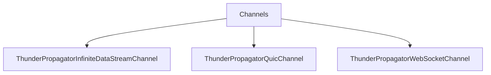

# Channels

## Contents

- [Overview](#overview)
- [Files](#files)
- [Types and Members](#types-and-members)
- [Serialization and Contracts](#serialization-and-contracts)
- [Validation and Constraints](#validation-and-constraints)
- [Diagrams](#diagrams)
- [Examples](#examples)
- [See Also](#see-also)

## Overview

The **Channels** area groups 3 documented types, including `ThunderPropagatorInfiniteDataStreamChannel`, `ThunderPropagatorQuicChannel`, `ThunderPropagatorWebSocketChannel`. It provides the contracts and implementation used by this part of ThunderPropagator.Clients.DotNet.

## Files

| File | Primary type(s)/symbol(s) | LOC (approx.) | Responsibility |
|---|---|---:|---|
| `ThunderPropagatorInfiniteDataStreamChannel.cs` | `ThunderPropagatorInfiniteDataStreamChannel` | 116 | Defines ThunderPropagatorInfiniteDataStreamChannel and its related behavior. |
| `ThunderPropagatorQuicChannel.cs` | `ThunderPropagatorQuicChannel` | 18 | Defines ThunderPropagatorQuicChannel and its related behavior. |
| `ThunderPropagatorWebSocketChannel.cs` | `ThunderPropagatorWebSocketChannel` | 18 | Defines ThunderPropagatorWebSocketChannel and its related behavior. |

## Types and Members

| Type | Kind | Summary | Inherits/Implements | Key Members |
|---|---|---|---|---|
| [`ThunderPropagatorInfiniteDataStreamChannel`](#thunderpropagatorinfinitedatastreamchannel) | class | Represents the ThunderPropagatorInfiniteDataStreamChannel class. | `AbstractThunderPropagatorChannel` | `RequestChannelMetadataAsync(…)`, `RequestSubscriptionAsync(…)` |
| [`ThunderPropagatorQuicChannel`](#thunderpropagatorquicchannel) | class | Represents the ThunderPropagatorQuicChannel class. | `AbstractThunderPropagatorChannel` | — |
| [`ThunderPropagatorWebSocketChannel`](#thunderpropagatorwebsocketchannel) | class | Represents the ThunderPropagatorWebSocketChannel class. | `AbstractThunderPropagatorChannel` | — |

### ThunderPropagatorInfiniteDataStreamChannel

- **Kind:** class
- **Namespace:** `ThunderPropagator.Clients.DotNet.Channels`
- **Inherits/implements:** `AbstractThunderPropagatorChannel`
- **Attributes:** None detected
- **Key members:** `RequestChannelMetadataAsync(…)`, `RequestSubscriptionAsync(…)`
- **Summary:** Represents the ThunderPropagatorInfiniteDataStreamChannel class.
- **Thread safety:** Follow the lifetime and concurrency guarantees of the owning component; no additional guarantee is inferred.

**Usage recipe**

```csharp
// Resolve ThunderPropagatorInfiniteDataStreamChannel from the configured service container or construct it with its declared dependencies.
```

[↑ Back to top](#contents)

### ThunderPropagatorQuicChannel

- **Kind:** class
- **Namespace:** `ThunderPropagator.Clients.DotNet.Channels`
- **Inherits/implements:** `AbstractThunderPropagatorChannel`
- **Attributes:** None detected
- **Key members:** Refer to the API surface in the source package
- **Summary:** Represents the ThunderPropagatorQuicChannel class.
- **Thread safety:** Follow the lifetime and concurrency guarantees of the owning component; no additional guarantee is inferred.

**Usage recipe**

```csharp
// Resolve ThunderPropagatorQuicChannel from the configured service container or construct it with its declared dependencies.
```

[↑ Back to top](#contents)

### ThunderPropagatorWebSocketChannel

- **Kind:** class
- **Namespace:** `ThunderPropagator.Clients.DotNet.Channels`
- **Inherits/implements:** `AbstractThunderPropagatorChannel`
- **Attributes:** None detected
- **Key members:** Refer to the API surface in the source package
- **Summary:** Represents the ThunderPropagatorWebSocketChannel class.
- **Thread safety:** Follow the lifetime and concurrency guarantees of the owning component; no additional guarantee is inferred.

**Usage recipe**

```csharp
// Resolve ThunderPropagatorWebSocketChannel from the configured service container or construct it with its declared dependencies.
```

[↑ Back to top](#contents)

## Serialization and Contracts

Serialization behavior is part of the public wire or persistence contract in this area. Preserve field names, ordering rules, content negotiation, and backward-compatibility expectations when changing these types.

## Validation and Constraints

Inputs are validated at component boundaries. Callers should provide non-null required values and handle domain or argument exceptions without retrying invalid requests unchanged.

## Diagrams

### Component overview



The diagram shows the direct components documented by the **Channels** area.

## Examples

Start with `ThunderPropagatorInfiniteDataStreamChannel` as the primary entry point for this folder, then follow its linked contracts and collaborators.

## See Also

- [Documentation home](../README.md)
- [Clients](../Clients/README.md)
- [Connections](../Connections/README.md)
- [Infrastructure](../Infrastructure/README.md)
- [Models](../Models/README.md)
- [instructions](../instructions/README.md)

[↑ Back to top](#contents)
