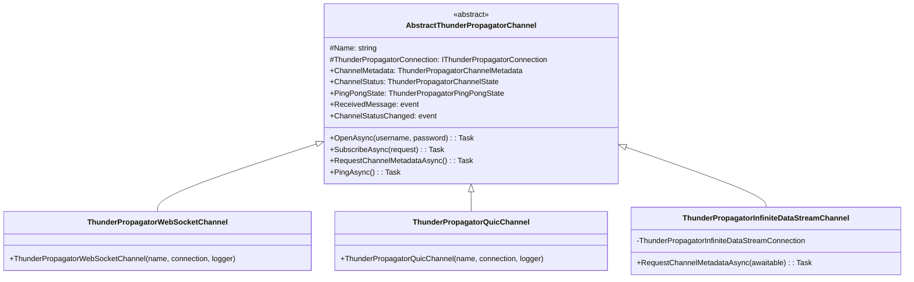
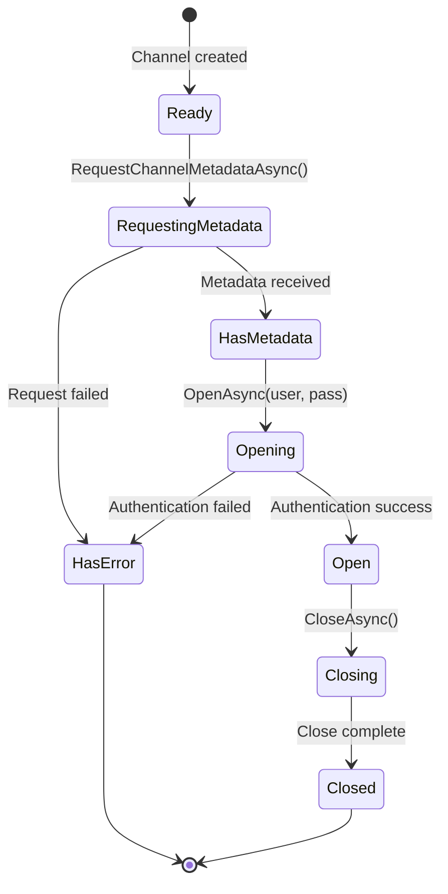

# Channels

## Contents

- [Overview](#overview)
- [Files](#files)
- [Types & Members](#types--members)
  - [ThunderPropagatorWebSocketChannel](#thunderpropagatorwebsocketchannel)
  - [ThunderPropagatorQuicChannel](#thunderpropagatorquicchannel)
  - [ThunderPropagatorInfiniteDataStreamChannel](#thunderpropagatorinfinitedatastreamchannel)
- [Diagrams](#diagrams)
  - [Channel Hierarchy](#channel-hierarchy)
  - [Channel Lifecycle](#channel-lifecycle)
- [Channel Operations](#channel-operations)
- [See Also](#see-also)

## Overview

The Channels folder contains protocol-specific channel implementations that handle logical communication channels, subscriptions, encryption, and metadata management for each supported transport protocol (WebSocket, QUIC, InfiniteDataStream).

Channels are created by clients and provide the main interface for:
- Requesting and receiving channel metadata
- Opening authenticated connections
- Subscribing to data streams
- Sending requests and receiving responses
- Managing encryption (auth encryption and message decryption)

All channel classes inherit from `AbstractThunderPropagatorChannel` and use conditional sealing (`#if !DEBUG sealed #endif`). The InfiniteDataStream channel extends base functionality with HTTP-based metadata requests.

## Files

| File | Primary Type | LOC (approx) | Responsibility |
|------|-------------|--------------|----------------|
| ThunderPropagatorWebSocketChannel.cs | ThunderPropagatorWebSocketChannel | ~18 | WebSocket protocol channel implementation |
| ThunderPropagatorQuicChannel.cs | ThunderPropagatorQuicChannel | ~18 | QUIC protocol channel implementation |
| ThunderPropagatorInfiniteDataStreamChannel.cs | ThunderPropagatorInfiniteDataStreamChannel | ~116 | InfiniteDataStream protocol channel with HTTP metadata support |

## Types & Members

### ThunderPropagatorWebSocketChannel

**Kind**: Class (internal, sealed in release builds)  
**Namespace**: `ThunderPropagator.Clients.DotNet.Channels`  
**Inherits**: `AbstractThunderPropagatorChannel`

WebSocket-specific channel implementation. Delegates all functionality to the abstract base class.

**Key Constructor**:

```csharp
internal ThunderPropagatorWebSocketChannel(
    string name, 
    IThunderPropagatorConnection thunderPropagatorConnection, 
    ILoggerProvider loggerProvider)
```

- `name` — Unique channel identifier
- `thunderPropagatorConnection` — WebSocket connection instance
- `loggerProvider` — Logger factory

**Inherited Properties** (from base):
- `ChannelMetadata` — Channel configuration and capabilities
- `ChannelStatus` — Current state (Ready, Opening, Open, etc.)
- `PingPongState` — Health check status

**Inherited Methods** (from base):
- `OpenAsync(username, password)` — Authenticate and open channel
- `SubscribeAsync(request)` — Subscribe to data stream
- `RequestChannelMetadataAsync()` — Fetch channel metadata
- `PingAsync()` — Send health check

**Thread-safety**: Safe for concurrent operations (inherited from base)

[↑ Back to top](#contents)

---

### ThunderPropagatorQuicChannel

**Kind**: Class (internal, sealed in release builds)  
**Namespace**: `ThunderPropagator.Clients.DotNet.Channels`  
**Inherits**: `AbstractThunderPropagatorChannel`

QUIC-specific channel implementation. Delegates all functionality to the abstract base class.

**Key Constructor**:

```csharp
internal ThunderPropagatorQuicChannel(
    string name, 
    IThunderPropagatorConnection thunderPropagatorConnection, 
    ILoggerProvider loggerProvider)
```

- `name` — Unique channel identifier
- `thunderPropagatorConnection` — QUIC connection instance
- `loggerProvider` — Logger factory

**Inherited Properties** (from base):
- `ChannelMetadata` — Channel configuration and capabilities
- `ChannelStatus` — Current state
- `PingPongState` — Health check status

**Inherited Methods** (from base):
- `OpenAsync(username, password)` — Authenticate and open channel
- `SubscribeAsync(request)` — Subscribe to data stream
- `RequestChannelMetadataAsync()` — Fetch channel metadata

**Thread-safety**: Safe for concurrent operations (inherited from base)

[↑ Back to top](#contents)

---

### ThunderPropagatorInfiniteDataStreamChannel

**Kind**: Class (internal, sealed in release builds)  
**Namespace**: `ThunderPropagator.Clients.DotNet.Channels`  
**Inherits**: `AbstractThunderPropagatorChannel`

InfiniteDataStream-specific channel implementation with HTTP-based metadata requests.

**Key Constructor**:

```csharp
internal ThunderPropagatorInfiniteDataStreamChannel(
    string name, 
    IThunderPropagatorConnection thunderPropagatorConnection, 
    ILoggerProvider loggerProvider)
```

- `name` — Unique channel identifier
- `thunderPropagatorConnection` — InfiniteDataStream connection instance (cast internally)
- `loggerProvider` — Logger factory

**Key Properties**:

```csharp
private ThunderPropagatorInfiniteDataStreamConnection ThunderPropagatorInfiniteDataStreamConnection
```
Returns the connection cast to the specific InfiniteDataStream type for HTTP operations.

**Overridden Methods**:

```csharp
public override async Task RequestChannelMetadataAsync(
    bool awaitable, 
    CancellationToken cancellationToken = default)
```

Fetches channel metadata via HTTP GET request to `/channel/{Name}/metadata`. Updates `ChannelStatus` to `RequestingMetadata`, then `HasMetadata` on success or `HasError` on failure.

**Thread-safety**: Safe for concurrent operations (inherited from base)

**Usage Recipe**:

```csharp
// InfiniteDataStream channels fetch metadata via HTTP
var channel = await client.CreateChannelAsync("myChannel");
await channel.RequestChannelMetadataAsync(awaitable: true);

// Metadata is now available
if (channel.ChannelMetadata != null)
{
    Console.WriteLine($"Channel supports: {channel.ChannelMetadata.RequestsDescriptor}");
}
```

[↑ Back to top](#contents)

---

## Diagrams

### Channel Hierarchy



Shows the channel hierarchy where WebSocket and QUIC channels are simple passthroughs, while InfiniteDataStream adds HTTP metadata support.

[↑ Back to top](#contents)

---

### Channel Lifecycle



Typical channel state transitions from creation through authentication and usage.

[↑ Back to top](#contents)

---

## Channel Operations

### Creating and Opening a Channel

```csharp
// Create channel through client
var channel = await client.CreateChannelAsync("marketData");

// Request metadata (optional but recommended)
await channel.RequestChannelMetadataAsync(awaitable: true);

// Open with authentication
await channel.OpenAsync("username", "password");

// Subscribe to receive messages
channel.ReceivedMessage += (sender, message, args) => 
{
    Console.WriteLine($"Received: {message.Data}");
};
```

### Subscription Management

```csharp
// Subscribe to data stream
var subscription = new ThunderPropagatorSubscriptionRequest
{
    Route = new ThunderPropagatorRequestRoute 
    { 
        Channel = "marketData", 
        Endpoint = "subscribe" 
    },
    // ... subscription details
};

await channel.SubscribeAsync(subscription);
```

### Health Checks

```csharp
// Ping channel to verify connectivity
await channel.PingAsync();

// Check ping state
if (channel.PingPongState == ThunderPropagatorPingPongState.Ponged)
{
    Console.WriteLine("Channel is healthy");
}
```

[↑ Back to top](#contents)

---

## See Also

- [Infrastructure/Channels](../Infrastructure/Channels/README.md) — Abstract channel base class and interfaces
- [Clients](../Clients/README.md) — Client facades that create channels
- [Connections](../Connections/README.md) — Connection implementations used by channels
- [Models/Metadata](../Models/Metadata/README.md) — Channel metadata structures

[↑ Back to top](#contents)
