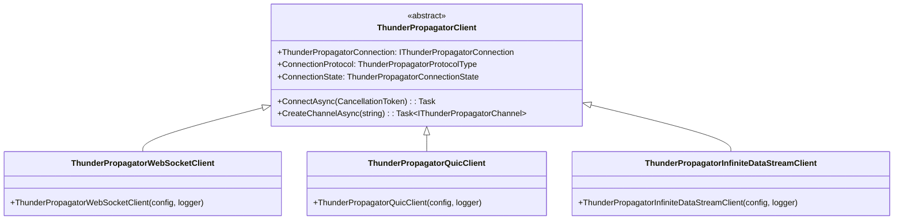
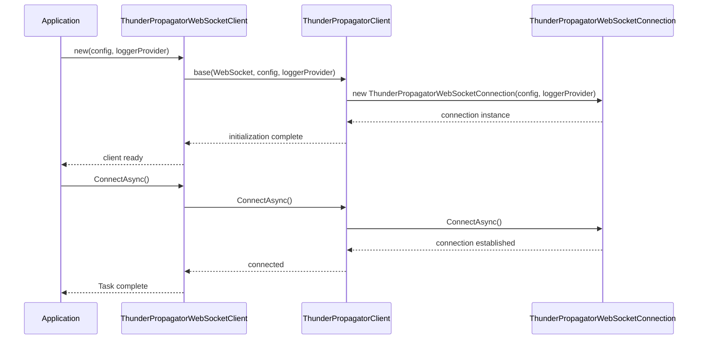

# Clients

## Contents

- [Overview](#overview)
- [Files](#files)
- [Types & Members](#types--members)
  - [ThunderPropagatorWebSocketClient](#thunderpropagatorwebsocketclient)
  - [ThunderPropagatorQuicClient](#thunderpropagatorquicclient)
  - [ThunderPropagatorInfiniteDataStreamClient](#thunderpropagatorinfinitedatastreamclient)
- [Diagrams](#diagrams)
  - [Client Hierarchy](#client-hierarchy)
  - [Client Creation Sequence](#client-creation-sequence)
- [Usage Examples](#usage-examples)
- [See Also](#see-also)

## Overview

The Clients folder contains protocol-specific client facades that serve as the primary entry points for creating connections to ThunderPropagator servers. Each client class is a thin wrapper around the protocol-agnostic `ThunderPropagatorClient` base class, specialized for a specific transport protocol (WebSocket, QUIC, or InfiniteDataStream).

All client classes use conditional sealing (`#if !DEBUG sealed #endif`) to allow inheritance in debug builds while preventing inheritance in release builds. These clients delegate all functionality to the base `ThunderPropagatorClient` class, which implements the three-layer architecture pattern.

## Files

| File | Primary Type | LOC (approx) | Responsibility |
|------|-------------|--------------|----------------|
| ThunderPropagatorWebSocketClient.cs | ThunderPropagatorWebSocketClient | ~18 | WebSocket protocol client facade |
| ThunderPropagatorQuicClient.cs | ThunderPropagatorQuicClient | ~18 | QUIC protocol client facade |
| ThunderPropagatorInfiniteDataStreamClient.cs | ThunderPropagatorInfiniteDataStreamClient | ~18 | InfiniteDataStream protocol client facade |

## Types & Members

### ThunderPropagatorWebSocketClient

**Kind**: Class (sealed in release builds)  
**Namespace**: `ThunderPropagator.Clients.DotNet.Clients`  
**Inherits**: `ThunderPropagatorClient`

Protocol-specific client for establishing WebSocket connections to ThunderPropagator servers.

**Key Constructor**:

```csharp
public ThunderPropagatorWebSocketClient(
    ThunderPropagatorWebSocketConnectionConfiguration configuration, 
    ILoggerProvider loggerProvider)
```

- `configuration` — WebSocket-specific connection configuration (URI, SSL settings, headers, etc.)
- `loggerProvider` — Logger factory for creating loggers

**Thread-safety**: Safe for concurrent operations (inherited from base)

**Usage Recipe**:

```csharp
var config = new ThunderPropagatorWebSocketConnectionConfiguration 
{
    Uri = "wss://server.example.com/thunderpropagator"
};

var client = new ThunderPropagatorWebSocketClient(config, loggerProvider);
await client.ConnectAsync();
var channel = await client.CreateChannelAsync("trades");
```

[↑ Back to top](#contents)

---

### ThunderPropagatorQuicClient

**Kind**: Class (sealed in release builds)  
**Namespace**: `ThunderPropagator.Clients.DotNet.Clients`  
**Inherits**: `ThunderPropagatorClient`

Protocol-specific client for establishing QUIC (HTTP/3) connections to ThunderPropagator servers.

**Key Constructor**:

```csharp
public ThunderPropagatorQuicClient(
    ThunderPropagatorQuicConnectionConfiguration configuration, 
    ILoggerProvider loggerProvider)
```

- `configuration` — QUIC-specific connection configuration (endpoint, certificate validation, etc.)
- `loggerProvider` — Logger factory for creating loggers

**Thread-safety**: Safe for concurrent operations (inherited from base)

**Usage Recipe**:

```csharp
var config = new ThunderPropagatorQuicConnectionConfiguration 
{
    // QUIC-specific configuration
};

var client = new ThunderPropagatorQuicClient(config, loggerProvider);
await client.ConnectAsync();
var channel = await client.CreateChannelAsync("market-data");
```

[↑ Back to top](#contents)

---

### ThunderPropagatorInfiniteDataStreamClient

**Kind**: Class (sealed in release builds)  
**Namespace**: `ThunderPropagator.Clients.DotNet.Clients`  
**Inherits**: `ThunderPropagatorClient`

Protocol-specific client for establishing InfiniteDataStream connections to ThunderPropagator servers.

**Key Constructor**:

```csharp
public ThunderPropagatorInfiniteDataStreamClient(
    ThunderPropagatorInfiniteDataStreamConnectionConfiguration configuration, 
    ILoggerProvider loggerProvider)
```

- `configuration` — InfiniteDataStream-specific connection configuration
- `loggerProvider` — Logger factory for creating loggers

**Thread-safety**: Safe for concurrent operations (inherited from base)

**Usage Recipe**:

```csharp
var config = new ThunderPropagatorInfiniteDataStreamConnectionConfiguration 
{
    // InfiniteDataStream-specific configuration
};

var client = new ThunderPropagatorInfiniteDataStreamClient(config, loggerProvider);
await client.ConnectAsync();
var channel = await client.CreateChannelAsync("events");
```

[↑ Back to top](#contents)

---

## Diagrams

### Client Hierarchy



The diagram shows the inheritance hierarchy where each protocol-specific client extends the base `ThunderPropagatorClient` class.

[↑ Back to top](#contents)

---

### Client Creation Sequence



This sequence shows the typical initialization and connection flow when creating a protocol-specific client.

[↑ Back to top](#contents)

---

## Usage Examples

### Creating Different Protocol Clients

```csharp
// WebSocket client
var wsConfig = new ThunderPropagatorWebSocketConnectionConfiguration 
{
    Uri = "wss://server.com/thunderpropagator"
};
var wsClient = new ThunderPropagatorWebSocketClient(wsConfig, loggerProvider);

// QUIC client
var quicConfig = new ThunderPropagatorQuicConnectionConfiguration 
{
    // QUIC settings
};
var quicClient = new ThunderPropagatorQuicClient(quicConfig, loggerProvider);

// InfiniteDataStream client
var idsConfig = new ThunderPropagatorInfiniteDataStreamConnectionConfiguration 
{
    // InfiniteDataStream settings
};
var idsClient = new ThunderPropagatorInfiniteDataStreamClient(idsConfig, loggerProvider);
```

### Complete Connection Lifecycle

```csharp
var config = new ThunderPropagatorWebSocketConnectionConfiguration 
{
    Uri = "wss://server.example.com/thunderpropagator"
};

var client = new ThunderPropagatorWebSocketClient(config, loggerProvider);

// Connect to server
await client.ConnectAsync();

// Check connection state
if (client.ConnectionState == ThunderPropagatorConnectionState.Open)
{
    // Create channel
    var channel = await client.CreateChannelAsync("myChannel");
    
    // Use channel...
    
    // Disconnect when done
    await client.Disconnect();
}
```

[↑ Back to top](#contents)

---

## See Also

- [ThunderPropagatorClient (root)](../README.md) — Base client implementation
- [Channels](../Channels/README.md) — Channel implementations for each protocol
- [Connections](../Connections/README.md) — Connection implementations for each protocol
- [Infrastructure/Connections](../Infrastructure/Connections/README.md) — Connection abstractions and base classes

[↑ Back to top](#contents)
