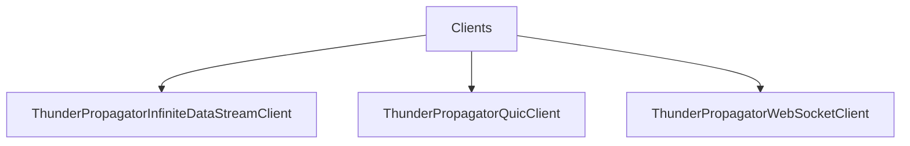

# Clients

## Contents

- [Overview](#overview)
- [Files](#files)
- [Types and Members](#types-and-members)
- [Serialization and Contracts](#serialization-and-contracts)
- [Diagrams](#diagrams)
- [Examples](#examples)
- [See Also](#see-also)

## Overview

The **Clients** area groups 3 documented types, including `ThunderPropagatorInfiniteDataStreamClient`, `ThunderPropagatorQuicClient`, `ThunderPropagatorWebSocketClient`. It provides the contracts and implementation used by this part of ThunderPropagator.Clients.DotNet.

## Files

| File | Primary type(s)/symbol(s) | LOC (approx.) | Responsibility |
|---|---|---:|---|
| `ThunderPropagatorInfiniteDataStreamClient.cs` | `ThunderPropagatorInfiniteDataStreamClient` | 18 | Defines ThunderPropagatorInfiniteDataStreamClient and its related behavior. |
| `ThunderPropagatorQuicClient.cs` | `ThunderPropagatorQuicClient` | 18 | Defines ThunderPropagatorQuicClient and its related behavior. |
| `ThunderPropagatorWebSocketClient.cs` | `ThunderPropagatorWebSocketClient` | 18 | Defines ThunderPropagatorWebSocketClient and its related behavior. |

## Types and Members

| Type | Kind | Summary | Inherits/Implements | Key Members |
|---|---|---|---|---|
| [`ThunderPropagatorInfiniteDataStreamClient`](#thunderpropagatorinfinitedatastreamclient) | class | Represents the ThunderPropagatorInfiniteDataStreamClient class. | `ThunderPropagatorClient` | — |
| [`ThunderPropagatorQuicClient`](#thunderpropagatorquicclient) | class | Represents the ThunderPropagatorQuicClient class. | `ThunderPropagatorClient` | — |
| [`ThunderPropagatorWebSocketClient`](#thunderpropagatorwebsocketclient) | class | Represents the ThunderPropagatorWebSocketClient class. | `ThunderPropagatorClient` | — |

### ThunderPropagatorInfiniteDataStreamClient

- **Kind:** class
- **Namespace:** `ThunderPropagator.Clients.DotNet.Clients`
- **Inherits/implements:** `ThunderPropagatorClient`
- **Attributes:** None detected
- **Key members:** Refer to the API surface in the source package
- **Summary:** Represents the ThunderPropagatorInfiniteDataStreamClient class.
- **Thread safety:** Follow the lifetime and concurrency guarantees of the owning component; no additional guarantee is inferred.

**Usage recipe**

```csharp
// Resolve ThunderPropagatorInfiniteDataStreamClient from the configured service container or construct it with its declared dependencies.
```

[↑ Back to top](#contents)

### ThunderPropagatorQuicClient

- **Kind:** class
- **Namespace:** `ThunderPropagator.Clients.DotNet.Clients`
- **Inherits/implements:** `ThunderPropagatorClient`
- **Attributes:** None detected
- **Key members:** Refer to the API surface in the source package
- **Summary:** Represents the ThunderPropagatorQuicClient class.
- **Thread safety:** Follow the lifetime and concurrency guarantees of the owning component; no additional guarantee is inferred.

**Usage recipe**

```csharp
// Resolve ThunderPropagatorQuicClient from the configured service container or construct it with its declared dependencies.
```

[↑ Back to top](#contents)

### ThunderPropagatorWebSocketClient

- **Kind:** class
- **Namespace:** `ThunderPropagator.Clients.DotNet.Clients`
- **Inherits/implements:** `ThunderPropagatorClient`
- **Attributes:** None detected
- **Key members:** Refer to the API surface in the source package
- **Summary:** Represents the ThunderPropagatorWebSocketClient class.
- **Thread safety:** Follow the lifetime and concurrency guarantees of the owning component; no additional guarantee is inferred.

**Usage recipe**

```csharp
// Resolve ThunderPropagatorWebSocketClient from the configured service container or construct it with its declared dependencies.
```

[↑ Back to top](#contents)

## Serialization and Contracts

Serialization behavior is part of the public wire or persistence contract in this area. Preserve field names, ordering rules, content negotiation, and backward-compatibility expectations when changing these types.

## Diagrams

### Component overview



The diagram shows the direct components documented by the **Clients** area.

## Examples

Start with `ThunderPropagatorInfiniteDataStreamClient` as the primary entry point for this folder, then follow its linked contracts and collaborators.

## See Also

- [Documentation home](../README.md)
- [Channels](../Channels/README.md)
- [Connections](../Connections/README.md)
- [Infrastructure](../Infrastructure/README.md)
- [Models](../Models/README.md)
- [instructions](../instructions/README.md)

[↑ Back to top](#contents)
