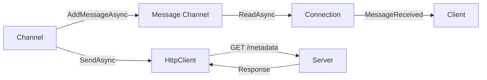

# Connections / InfiniteDataStream

## Contents

- [Overview](#overview)
- [Files](#files)
- [Types & Members](#types--members)
- [Diagrams](#diagrams)
- [Usage Examples](#usage-examples)
- [See Also](#see-also)

## Overview

The InfiniteDataStream subdirectory contains the InfiniteDataStream protocol implementation using HTTP-based streaming. Uses `HttpClient` for HTTP requests and an unbounded channel for message queuing.

## Files

| File | Primary Type | LOC (approx) | Responsibility |
|------|-------------|--------------|----------------|
| ThunderPropagatorInfiniteDataStreamConnection.cs | ThunderPropagatorInfiniteDataStreamConnection | ~50 | InfiniteDataStream connection via HTTP |
| ThunderPropagatorInfiniteDataStreamConnectionConfiguration.cs | ThunderPropagatorInfiniteDataStreamConnectionConfiguration | ~15 | InfiniteDataStream configuration |

## Types & Members

### ThunderPropagatorInfiniteDataStreamConnection

**Kind**: Class (internal, sealed in release builds)  
**Namespace**: `ThunderPropagator.Clients.DotNet.Connections.InfiniteDataStream`  
**Inherits**: `AbstractThunderPropagatorConnection<ThunderPropagatorInfiniteDataStreamConnectionConfiguration>`

HTTP-based streaming connection with message channel buffering.

**Key Properties**:

- `_httpClient: HttpClient` — Configured with infinite timeout and base address
- `_receivedMessagesChannel: Channel<string>` — Unbounded channel for message queuing

**Key Methods**:

```csharp
internal Task<HttpResponseMessage> SendAsync(
    HttpRequestMessage requestMessage,
    HttpCompletionOption httpCompletionOption = ResponseContentRead,
    CancellationToken cancellationToken = default)
```

Sends HTTP request. Used by channels for metadata requests.

```csharp
internal ValueTask AddMessageAsync(string message, CancellationToken cancellationToken = default)
```

Adds message to receive channel. Used for streaming message ingestion.

**Overridden Methods**:

- `InternalConnectAsync()` — Writes "PROBE" to channel
- `ReceiveAsync()` — Reads from message channel
- `InternalSendAsync()` — No-op (HTTP requests use `SendAsync` directly)
- `InternalDisconnectAsync()` — No-op

[↑ Back to top](#contents)

---

### ThunderPropagatorInfiniteDataStreamConnectionConfiguration

**Kind**: Class (public, sealed in release builds)  
**Namespace**: `ThunderPropagator.Clients.DotNet.Connections.InfiniteDataStream`  
**Inherits**: `AbstractThunderPropagatorConfiguration`

Configuration inherits `Uri` from base class.

[↑ Back to top](#contents)

---

## Diagrams

### InfiniteDataStream Architecture



[↑ Back to top](#contents)

---

## Usage Examples

```csharp
var config = new ThunderPropagatorInfiniteDataStreamConnectionConfiguration
{
    Uri = "https://server.example.com"
};

var connection = new ThunderPropagatorInfiniteDataStreamConnection(config, loggerProvider);
await connection.ConnectAsync();

// HTTP requests via SendAsync
var httpRequest = new HttpRequestMessage(HttpMethod.Get, "/channel/test/metadata");
var response = await connection.SendAsync(httpRequest);
```

[↑ Back to top](#contents)

---

## See Also

- [Connections](../README.md) — Parent connections overview
- [Channels](../../Channels/README.md) — InfiniteDataStream channel with HTTP metadata

[↑ Back to top](#contents)
