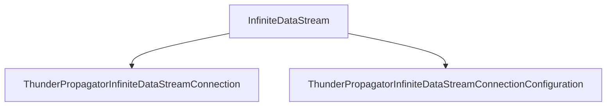

# InfiniteDataStream

## Contents

- [Overview](#overview)
- [Files](#files)
- [Types and Members](#types-and-members)
- [Performance Notes](#performance-notes)
- [Diagrams](#diagrams)
- [Examples](#examples)
- [See Also](#see-also)

## Overview

The **InfiniteDataStream** area groups 2 documented types, including `ThunderPropagatorInfiniteDataStreamConnection`, `ThunderPropagatorInfiniteDataStreamConnectionConfiguration`. It provides the contracts and implementation used by this part of ThunderPropagator.Clients.DotNet.

## Files

| File | Primary type(s)/symbol(s) | LOC (approx.) | Responsibility |
|---|---|---:|---|
| `ThunderPropagatorInfiniteDataStreamConnection.cs` | `ThunderPropagatorInfiniteDataStreamConnection` | 52 | Defines ThunderPropagatorInfiniteDataStreamConnection and its related behavior. |
| `ThunderPropagatorInfiniteDataStreamConnectionConfiguration.cs` | `ThunderPropagatorInfiniteDataStreamConnectionConfiguration` | 12 | Defines ThunderPropagatorInfiniteDataStreamConnectionConfiguration and its related behavior. |

## Types and Members

| Type | Kind | Summary | Inherits/Implements | Key Members |
|---|---|---|---|---|
| [`ThunderPropagatorInfiniteDataStreamConnection`](#thunderpropagatorinfinitedatastreamconnection) | class | Represents the ThunderPropagatorInfiniteDataStreamConnection class. | `AbstractThunderPropagatorConnection<ThunderPropagatorInfiniteDataStreamConnectionConfiguration>` | `InternalConnectAsync(…)`, `InternalDisconnectAsync(…)`, `ReceiveAsync(…)`, `InternalSendAsync(…)`, `SendAsync(…)`, `AddMessageAsync(…)` |
| [`ThunderPropagatorInfiniteDataStreamConnectionConfiguration`](#thunderpropagatorinfinitedatastreamconnectionconfiguration) | class | Represents the ThunderPropagatorInfiniteDataStreamConnectionConfiguration class. | `AbstractThunderPropagatorConfiguration` | — |

### ThunderPropagatorInfiniteDataStreamConnection

- **Kind:** class
- **Namespace:** `ThunderPropagator.Clients.DotNet.Connections.InfiniteDataStream`
- **Inherits/implements:** `AbstractThunderPropagatorConnection<ThunderPropagatorInfiniteDataStreamConnectionConfiguration>`
- **Attributes:** None detected
- **Key members:** `InternalConnectAsync(…)`, `InternalDisconnectAsync(…)`, `ReceiveAsync(…)`, `InternalSendAsync(…)`, `SendAsync(…)`, `AddMessageAsync(…)`, `DisposeManagedResources(…)`
- **Summary:** Represents the ThunderPropagatorInfiniteDataStreamConnection class.
- **Thread safety:** Follow the lifetime and concurrency guarantees of the owning component; no additional guarantee is inferred.

**Usage recipe**

```csharp
// Resolve ThunderPropagatorInfiniteDataStreamConnection from the configured service container or construct it with its declared dependencies.
```

[↑ Back to top](#contents)

### ThunderPropagatorInfiniteDataStreamConnectionConfiguration

- **Kind:** class
- **Namespace:** `ThunderPropagator.Clients.DotNet.Connections.InfiniteDataStream`
- **Inherits/implements:** `AbstractThunderPropagatorConfiguration`
- **Attributes:** None detected
- **Key members:** Refer to the API surface in the source package
- **Summary:** Represents the ThunderPropagatorInfiniteDataStreamConnectionConfiguration class.
- **Thread safety:** Follow the lifetime and concurrency guarantees of the owning component; no additional guarantee is inferred.

**Usage recipe**

```csharp
// Resolve ThunderPropagatorInfiniteDataStreamConnectionConfiguration from the configured service container or construct it with its declared dependencies.
```

[↑ Back to top](#contents)

## Performance Notes

This area contains performance-sensitive constructs such as pooled buffers, spans, asynchronous value types, or concurrent collections. Avoid unnecessary allocations and blocking calls on streaming or message-processing paths.

## Diagrams

### Component overview



The diagram shows the direct components documented by the **InfiniteDataStream** area.

## Examples

Start with `ThunderPropagatorInfiniteDataStreamConnection` as the primary entry point for this folder, then follow its linked contracts and collaborators.

## See Also

- [Parent area](../README.md)
- [Quic](../Quic/README.md)
- [WebSocket](../WebSocket/README.md)

[↑ Back to top](#contents)
