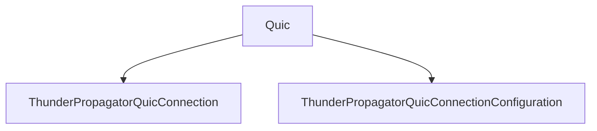

# Quic

## Contents

- [Overview](#overview)
- [Files](#files)
- [Types and Members](#types-and-members)
- [Serialization and Contracts](#serialization-and-contracts)
- [Validation and Constraints](#validation-and-constraints)
- [Performance Notes](#performance-notes)
- [Diagrams](#diagrams)
- [Examples](#examples)
- [See Also](#see-also)

## Overview

The **Quic** area groups 2 documented types, including `ThunderPropagatorQuicConnection`, `ThunderPropagatorQuicConnectionConfiguration`. It provides the contracts and implementation used by this part of ThunderPropagator.Clients.DotNet.

## Files

| File | Primary type(s)/symbol(s) | LOC (approx.) | Responsibility |
|---|---|---:|---|
| `ThunderPropagatorQuicConnection.cs` | `ThunderPropagatorQuicConnection` | 84 | Defines ThunderPropagatorQuicConnection and its related behavior. |
| `ThunderPropagatorQuicConnectionConfiguration.cs` | `ThunderPropagatorQuicConnectionConfiguration` | 63 | Defines ThunderPropagatorQuicConnectionConfiguration and its related behavior. |

## Types and Members

| Type | Kind | Summary | Inherits/Implements | Key Members |
|---|---|---|---|---|
| [`ThunderPropagatorQuicConnection`](#thunderpropagatorquicconnection) | class | Represents the ThunderPropagatorQuicConnection class. | `AbstractThunderPropagatorConnection<ThunderPropagatorQuicConnectionConfiguration>` | `InternalConnectAsync(…)`, `InternalDisconnectAsync(…)`, `ReceiveAsync(…)`, `InternalSendAsync(…)`, `DisposeManagedResourcesAsync(…)` |
| [`ThunderPropagatorQuicConnectionConfiguration`](#thunderpropagatorquicconnectionconfiguration) | class | Represents the ThunderPropagatorQuicConnectionConfiguration class. | `AbstractThunderPropagatorConfiguration` | — |

### ThunderPropagatorQuicConnection

- **Kind:** class
- **Namespace:** `ThunderPropagator.Clients.DotNet.Connections.Quic`
- **Inherits/implements:** `AbstractThunderPropagatorConnection<ThunderPropagatorQuicConnectionConfiguration>`
- **Attributes:** None detected
- **Key members:** `InternalConnectAsync(…)`, `InternalDisconnectAsync(…)`, `ReceiveAsync(…)`, `InternalSendAsync(…)`, `DisposeManagedResourcesAsync(…)`
- **Summary:** Represents the ThunderPropagatorQuicConnection class.
- **Thread safety:** Follow the lifetime and concurrency guarantees of the owning component; no additional guarantee is inferred.

**Usage recipe**

```csharp
// Resolve ThunderPropagatorQuicConnection from the configured service container or construct it with its declared dependencies.
```

[↑ Back to top](#contents)

### ThunderPropagatorQuicConnectionConfiguration

- **Kind:** class
- **Namespace:** `ThunderPropagator.Clients.DotNet.Connections.Quic`
- **Inherits/implements:** `AbstractThunderPropagatorConfiguration`
- **Attributes:** None detected
- **Key members:** Refer to the API surface in the source package
- **Summary:** Represents the ThunderPropagatorQuicConnectionConfiguration class.
- **Thread safety:** Follow the lifetime and concurrency guarantees of the owning component; no additional guarantee is inferred.

**Usage recipe**

```csharp
// Resolve ThunderPropagatorQuicConnectionConfiguration from the configured service container or construct it with its declared dependencies.
```

[↑ Back to top](#contents)

## Serialization and Contracts

Serialization behavior is part of the public wire or persistence contract in this area. Preserve field names, ordering rules, content negotiation, and backward-compatibility expectations when changing these types.

## Validation and Constraints

Inputs are validated at component boundaries. Callers should provide non-null required values and handle domain or argument exceptions without retrying invalid requests unchanged.

## Performance Notes

This area contains performance-sensitive constructs such as pooled buffers, spans, asynchronous value types, or concurrent collections. Avoid unnecessary allocations and blocking calls on streaming or message-processing paths.

## Diagrams

### Component overview



The diagram shows the direct components documented by the **Quic** area.

## Examples

Start with `ThunderPropagatorQuicConnection` as the primary entry point for this folder, then follow its linked contracts and collaborators.

## See Also

- [Parent area](../README.md)
- [InfiniteDataStream](../InfiniteDataStream/README.md)
- [WebSocket](../WebSocket/README.md)

[↑ Back to top](#contents)
