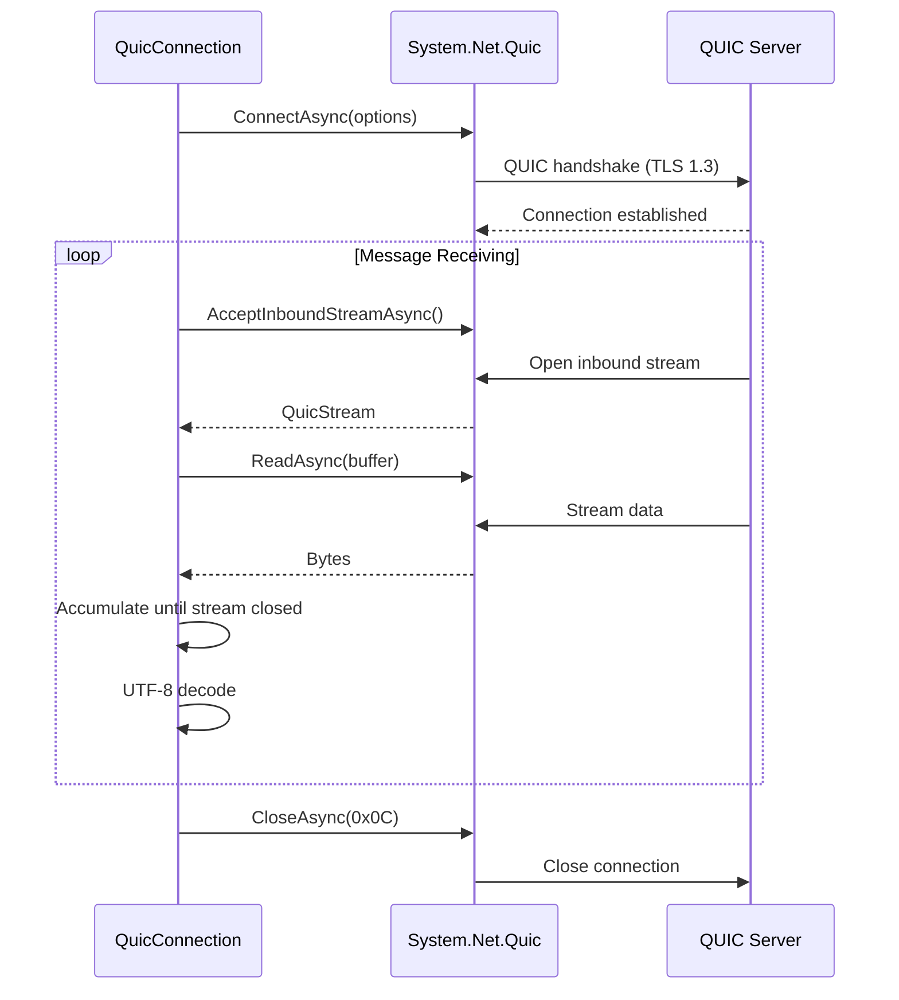

# Connections / Quic

## Contents

- [Overview](#overview)
- [Files](#files)
- [Types & Members](#types--members)
- [Diagrams](#diagrams)
- [Usage Examples](#usage-examples)
- [See Also](#see-also)

## Overview

The Quic subdirectory contains the QUIC (HTTP/3) protocol implementation for ThunderPropagator connections. QUIC is a modern transport protocol offering low latency, multiplexing, and improved connection migration. Requires TLS 1.3 and libmsquic support.

## Files

| File | Primary Type | LOC (approx) | Responsibility |
|------|-------------|--------------|----------------|
| ThunderPropagatorQuicConnection.cs | ThunderPropagatorQuicConnection | ~90 | QUIC connection implementation |
| ThunderPropagatorQuicConnectionConfiguration.cs | ThunderPropagatorQuicConnectionConfiguration | ~63 | QUIC-specific configuration |

## Types & Members

### ThunderPropagatorQuicConnection

**Kind**: Class (internal, sealed in release builds)  
**Namespace**: `ThunderPropagator.Clients.DotNet.Connections.Quic`  
**Inherits**: `AbstractThunderPropagatorConnection<ThunderPropagatorQuicConnectionConfiguration>`

QUIC protocol connection using .NET's `QuicConnection`. Supports bidirectional and unidirectional streams.

**Key Constructor**:

```csharp
internal ThunderPropagatorQuicConnection(
    ThunderPropagatorQuicConnectionConfiguration connectionConfiguration,
    ILoggerProvider loggerProvider)
```

Validates QUIC support and TLS 1.3 availability. Throws `InvalidOperationException` if QUIC is not supported.

**Overridden Methods**:

- `InternalConnectAsync()` — Establishes QUIC connection
- `InternalDisconnectAsync()` — Closes connection with error code 0x0C
- `ReceiveAsync()` — Accepts inbound stream and reads until completion
- `InternalSendAsync()` — Opens outbound stream, writes message, completes writes

[↑ Back to top](#contents)

---

### ThunderPropagatorQuicConnectionConfiguration

**Kind**: Class (public, sealed in release builds)  
**Namespace**: `ThunderPropagator.Clients.DotNet.Connections.Quic`  
**Inherits**: `AbstractThunderPropagatorConfiguration`

**Key Properties**:

- `RemoteEndPoint: EndPoint` — QUIC server endpoint (required)
- `DefaultStreamErrorCode: long` — Default: 0x0A
- `DefaultCloseErrorCode: long` — Default: 0x0B
- `MaxInboundBidirectionalStreams: int` — Default: 0
- `MaxInboundUnidirectionalStreams: int` — Default: 0
- `SslProtocols: string[]` — Application protocols for TLS negotiation
- `StreamType: QuicStreamType` — Bidirectional or Unidirectional streams
- `BufferSize: int` — Receive buffer size, default: 4096 bytes

[↑ Back to top](#contents)

---

## Diagrams

### QUIC Stream Flow



[↑ Back to top](#contents)

---

## Usage Examples

```csharp
var config = new ThunderPropagatorQuicConnectionConfiguration
{
    RemoteEndPoint = new IPEndPoint(IPAddress.Parse("192.168.1.100"), 443),
    SslProtocols = new[] { "h3" },  // HTTP/3
    StreamType = QuicStreamType.Bidirectional,
    BufferSize = 8192
};

var connection = new ThunderPropagatorQuicConnection(config, loggerProvider);
await connection.ConnectAsync();
```

[↑ Back to top](#contents)

---

## See Also

- [Connections](../README.md) — Parent connections overview
- [Infrastructure/Connections](../../Infrastructure/Connections/README.md) — Abstract connection base

[↑ Back to top](#contents)
