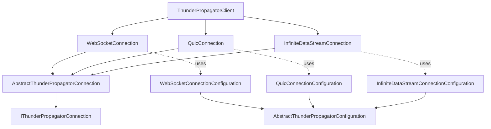
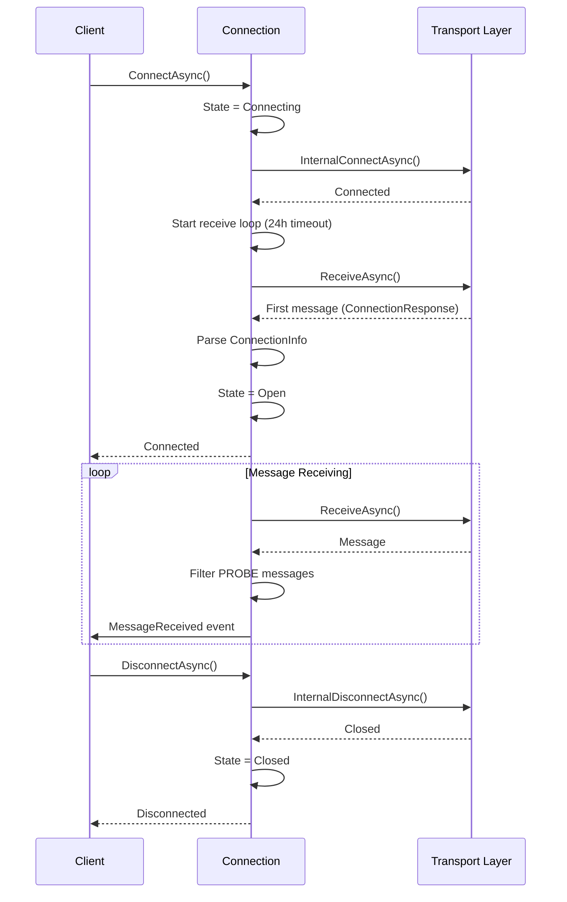

# Connections

## Contents

- [Overview](#overview)
- [Protocol Implementations](#protocol-implementations)
- [Diagrams](#diagrams)
  - [Connection Architecture](#connection-architecture)
  - [Connection Lifecycle](#connection-lifecycle)
- [See Also](#see-also)

## Overview

The Connections folder contains transport layer implementations for each supported protocol (WebSocket, QUIC, InfiniteDataStream). Each protocol has its own subdirectory with connection and configuration classes.

Connections are responsible for:
- Managing protocol-specific transport layer
- Connection state management (Ready, Connecting, Open, Closed, HasError)
- Message receipt and transmission
- Auto-reconnection with 24-hour receive timeout
- Filtering PROBE messages
- Parsing initial connection response

All connection implementations extend `AbstractThunderPropagatorConnection<T>` where `T` is the protocol-specific configuration class.

## Protocol Implementations

### [WebSocket](./WebSocket/README.md)
WebSocket protocol implementation using .NET's `ClientWebSocket`. Supports:
- Standard WebSocket connections (ws:// and wss://)
- Configurable buffer sizes
- Text message framing
- Automatic reconnection

`Types:2` `Files:2` `Diagrams:✓`

### [Quic](./Quic/README.md)
QUIC (HTTP/3) protocol implementation for low-latency connections. Supports:
- QUIC stream-based communication
- Modern transport protocol
- Certificate validation

`Types:2` `Files:2` `Diagrams:✓`

### [InfiniteDataStream](./InfiniteDataStream/README.md)
InfiniteDataStream protocol implementation with HTTP support. Supports:
- Long-lived HTTP streaming
- HTTP-based metadata requests
- Server-sent events style communication

`Types:2` `Files:2` `Diagrams:✓`

## Diagrams

### Connection Architecture

Shows how protocol-specific connections inherit from the abstract base and use their corresponding configurations.

[↑ Back to top](#contents)

---

### Connection Lifecycle

Typical connection lifecycle from establishment through message receiving to disconnection.

[↑ Back to top](#contents)

---

## See Also

- [Infrastructure/Connections](../Infrastructure/Connections/README.md) — Abstract connection base class and interfaces
- [Clients](../Clients/README.md) — Client facades that use connections
- [Channels](../Channels/README.md) — Channels that communicate through connections

[↑ Back to top](#contents)
