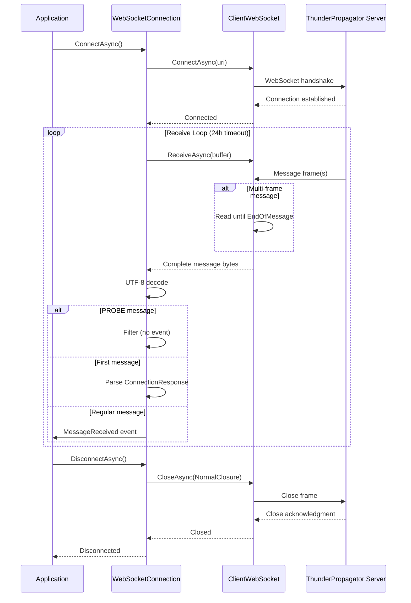

# Connections / WebSocket

## Contents

- [Overview](#overview)
- [Files](#files)
- [Types & Members](#types--members)
  - [ThunderPropagatorWebSocketConnection](#thunderpropagatorwebsocketconnection)
  - [ThunderPropagatorWebSocketConnectionConfiguration](#thunderpropagatorwebsocketconnectionconfiguration)
- [Diagrams](#diagrams)
  - [WebSocket Message Flow](#websocket-message-flow)
- [Usage Examples](#usage-examples)
- [See Also](#see-also)

## Overview

The WebSocket subdirectory contains the WebSocket protocol implementation for ThunderPropagator connections. It uses .NET's `ClientWebSocket` for standard WebSocket communication (ws:// and wss://) with configurable buffer sizes and automatic message framing.

WebSocket connections support:
- Standard WebSocket protocol (RFC 6455)
- Secure WebSocket (TLS/SSL)
- Configurable receive buffer size
- UTF-8 text message encoding
- Automatic message assembly for multi-frame messages

## Files

| File | Primary Type | LOC (approx) | Responsibility |
|------|-------------|--------------|----------------|
| ThunderPropagatorWebSocketConnection.cs | ThunderPropagatorWebSocketConnection | ~70 | WebSocket connection implementation |
| ThunderPropagatorWebSocketConnectionConfiguration.cs | ThunderPropagatorWebSocketConnectionConfiguration | ~15 | WebSocket-specific configuration |

## Types & Members

### ThunderPropagatorWebSocketConnection

**Kind**: Class (internal, sealed in release builds)  
**Namespace**: `ThunderPropagator.Clients.DotNet.Connections.WebSocket`  
**Inherits**: `AbstractThunderPropagatorConnection<ThunderPropagatorWebSocketConnectionConfiguration>`

WebSocket-specific connection implementation using `ClientWebSocket`.

**Key Properties**:

```csharp
private readonly ClientWebSocket _clientWebSocket
```
The underlying WebSocket client instance.

**Key Constructor**:

```csharp
internal ThunderPropagatorWebSocketConnection(
    ThunderPropagatorWebSocketConnectionConfiguration connectionConfiguration, 
    ILoggerProvider loggerProvider)
```

- `connectionConfiguration` — WebSocket configuration (URI, buffer size)
- `loggerProvider` — Logger factory for creating loggers

**Overridden Methods**:

```csharp
protected override Task InternalConnectAsync(CancellationToken cancellationToken = default)
```
Connects to the WebSocket server using the configured URI. Throws `InvalidOperationException` if URI is not configured.

```csharp
protected override Task InternalDisconnectAsync(CancellationToken cancellationToken = default)
```
Closes the WebSocket connection with `NormalClosure` status and "CLOSED_BY_CLIENT" message.

```csharp
protected override async ValueTask<string> ReceiveAsync(CancellationToken cancellationToken = default)
```
Receives a complete WebSocket message. Handles multi-frame messages by reading until `EndOfMessage` is true. Returns UTF-8 decoded string. Throws `InvalidOperationException` if socket is not open.

```csharp
protected override Task InternalSendAsync(string message, CancellationToken cancellationToken)
```
Sends a text message through the WebSocket connection with `EndOfMessage = true`.

**Disposal**:

```csharp
protected override void DisposeManagedResources()
```
Disposes the underlying `ClientWebSocket` instance.

**Thread-safety**: Safe for concurrent operations (inherited semaphore protection from base)

**Usage Recipe**:

```csharp
var config = new ThunderPropagatorWebSocketConnectionConfiguration 
{
    Uri = "wss://server.example.com/thunderpropagator",
    BufferSize = 8192
};

var connection = new ThunderPropagatorWebSocketConnection(config, loggerProvider);

connection.MessageReceived += async (sender, message, ct) => 
{
    Console.WriteLine($"Received: {message}");
};

await connection.ConnectAsync();
// Connection is now open and receiving messages
```

[↑ Back to top](#contents)

---

### ThunderPropagatorWebSocketConnectionConfiguration

**Kind**: Class (public, sealed in release builds)  
**Namespace**: `ThunderPropagator.Clients.DotNet.Connections.WebSocket`  
**Inherits**: `AbstractThunderPropagatorConfiguration`

Configuration class for WebSocket connections using the Get/Set pattern from `ServiceConfiguration`.

**Key Properties**:

```csharp
public int BufferSize { get; set; }
```
Size of the receive buffer in bytes. Default: `4096` (4 KB). Larger buffers can improve performance for high-throughput scenarios but consume more memory.

**Inherited Properties** (from `AbstractThunderPropagatorConfiguration`):

```csharp
public string Uri { get; set; }
```
WebSocket server URI (ws:// or wss://). Required.

**Configuration Pattern**:

Uses the `Get<T>(defaultValue)` and `Set(value)` pattern:

```csharp
public int BufferSize
{
    get => Get(1024 * 4);  // Default: 4096 bytes
    set => Set(value);
}
```

**Thread-safety**: Configuration should be set before creating the connection

**Usage Recipe**:

```csharp
var config = new ThunderPropagatorWebSocketConnectionConfiguration 
{
    Uri = "wss://server.example.com/thunderpropagator",
    BufferSize = 8192  // 8 KB buffer for larger messages
};

// Configuration is immutable after connection creation
var connection = new ThunderPropagatorWebSocketConnection(config, loggerProvider);
```

[↑ Back to top](#contents)

---

## Diagrams

### WebSocket Message Flow



Shows the complete WebSocket connection lifecycle including handshake, message receiving with multi-frame handling, and graceful closure.

[↑ Back to top](#contents)

---

## Usage Examples

### Basic WebSocket Connection

```csharp
var config = new ThunderPropagatorWebSocketConnectionConfiguration 
{
    Uri = "wss://api.example.com/thunderpropagator"
};

var connection = new ThunderPropagatorWebSocketConnection(config, loggerProvider);

// Subscribe to messages
connection.MessageReceived += async (sender, message, ct) => 
{
    Console.WriteLine($"Received: {message}");
};

// Subscribe to state changes
connection.ConnectionStateChanged += (sender, state, args) => 
{
    Console.WriteLine($"State changed: {state}");
};

await connection.ConnectAsync();
```

### Configuring Buffer Size

```csharp
// Small buffer for low-frequency, small messages
var smallConfig = new ThunderPropagatorWebSocketConnectionConfiguration 
{
    Uri = "wss://server.com/thunderpropagator",
    BufferSize = 2048  // 2 KB
};

// Large buffer for high-throughput scenarios
var largeConfig = new ThunderPropagatorWebSocketConnectionConfiguration 
{
    Uri = "wss://server.com/thunderpropagator",
    BufferSize = 32768  // 32 KB
};
```

### Sending Messages

```csharp
await connection.ConnectAsync();

// Send a message (inherited from base)
await connection.SendAsync("{\"type\":\"ping\"}", CancellationToken.None);
```

[↑ Back to top](#contents)

---

## See Also

- [Connections](../README.md) — Parent connections overview
- [Infrastructure/Connections](../../Infrastructure/Connections/README.md) — Abstract connection base class
- [Clients](../../Clients/README.md) — WebSocket client facade
- [Channels](../../Channels/README.md) — WebSocket channel implementation

[↑ Back to top](#contents)
