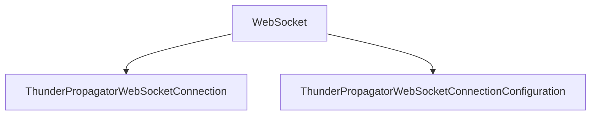

# WebSocket

## Contents

- [Overview](#overview)
- [Files](#files)
- [Types and Members](#types-and-members)
- [Validation and Constraints](#validation-and-constraints)
- [Performance Notes](#performance-notes)
- [Diagrams](#diagrams)
- [Examples](#examples)
- [See Also](#see-also)

## Overview

The **WebSocket** area groups 2 documented types, including `ThunderPropagatorWebSocketConnection`, `ThunderPropagatorWebSocketConnectionConfiguration`. It provides the contracts and implementation used by this part of ThunderPropagator.Clients.DotNet.

## Files

| File | Primary type(s)/symbol(s) | LOC (approx.) | Responsibility |
|---|---|---:|---|
| `ThunderPropagatorWebSocketConnection.cs` | `ThunderPropagatorWebSocketConnection` | 70 | Defines ThunderPropagatorWebSocketConnection and its related behavior. |
| `ThunderPropagatorWebSocketConnectionConfiguration.cs` | `ThunderPropagatorWebSocketConnectionConfiguration` | 17 | Defines ThunderPropagatorWebSocketConnectionConfiguration and its related behavior. |

## Types and Members

| Type | Kind | Summary | Inherits/Implements | Key Members |
|---|---|---|---|---|
| [`ThunderPropagatorWebSocketConnection`](#thunderpropagatorwebsocketconnection) | class | Represents the ThunderPropagatorWebSocketConnection class. | `AbstractThunderPropagatorConnection<ThunderPropagatorWebSocketConnectionConfiguration>` | `InternalConnectAsync(…)`, `InternalDisconnectAsync(…)`, `ReceiveAsync(…)`, `InternalSendAsync(…)`, `DisposeManagedResources(…)` |
| [`ThunderPropagatorWebSocketConnectionConfiguration`](#thunderpropagatorwebsocketconnectionconfiguration) | class | Represents the ThunderPropagatorWebSocketConnectionConfiguration class. | `AbstractThunderPropagatorConfiguration` | — |

### ThunderPropagatorWebSocketConnection

- **Kind:** class
- **Namespace:** `ThunderPropagator.Clients.DotNet.Connections.WebSocket`
- **Inherits/implements:** `AbstractThunderPropagatorConnection<ThunderPropagatorWebSocketConnectionConfiguration>`
- **Attributes:** None detected
- **Key members:** `InternalConnectAsync(…)`, `InternalDisconnectAsync(…)`, `ReceiveAsync(…)`, `InternalSendAsync(…)`, `DisposeManagedResources(…)`
- **Summary:** Represents the ThunderPropagatorWebSocketConnection class.
- **Thread safety:** Follow the lifetime and concurrency guarantees of the owning component; no additional guarantee is inferred.

**Usage recipe**

```csharp
// Resolve ThunderPropagatorWebSocketConnection from the configured service container or construct it with its declared dependencies.
```

[↑ Back to top](#contents)

### ThunderPropagatorWebSocketConnectionConfiguration

- **Kind:** class
- **Namespace:** `ThunderPropagator.Clients.DotNet.Connections.WebSocket`
- **Inherits/implements:** `AbstractThunderPropagatorConfiguration`
- **Attributes:** None detected
- **Key members:** Refer to the API surface in the source package
- **Summary:** Represents the ThunderPropagatorWebSocketConnectionConfiguration class.
- **Thread safety:** Follow the lifetime and concurrency guarantees of the owning component; no additional guarantee is inferred.

**Usage recipe**

```csharp
// Resolve ThunderPropagatorWebSocketConnectionConfiguration from the configured service container or construct it with its declared dependencies.
```

[↑ Back to top](#contents)

## Validation and Constraints

Inputs are validated at component boundaries. Callers should provide non-null required values and handle domain or argument exceptions without retrying invalid requests unchanged.

## Performance Notes

This area contains performance-sensitive constructs such as pooled buffers, spans, asynchronous value types, or concurrent collections. Avoid unnecessary allocations and blocking calls on streaming or message-processing paths.

## Diagrams

### Component overview



The diagram shows the direct components documented by the **WebSocket** area.

## Examples

Start with `ThunderPropagatorWebSocketConnection` as the primary entry point for this folder, then follow its linked contracts and collaborators.

## See Also

- [Parent area](../README.md)
- [InfiniteDataStream](../InfiniteDataStream/README.md)
- [Quic](../Quic/README.md)

[↑ Back to top](#contents)
