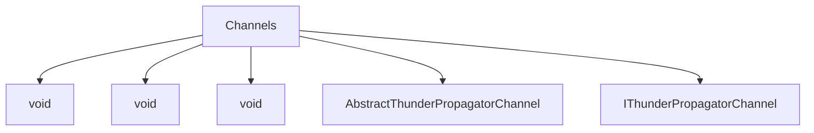

# Channels

## Contents

- [Overview](#overview)
- [Files](#files)
- [Types and Members](#types-and-members)
- [Serialization and Contracts](#serialization-and-contracts)
- [Validation and Constraints](#validation-and-constraints)
- [Diagrams](#diagrams)
- [Examples](#examples)
- [See Also](#see-also)

## Overview

The **Channels** area groups 5 documented types, including `void`, `void`, `void`, `AbstractThunderPropagatorChannel`, `IThunderPropagatorChannel`. It provides the contracts and implementation used by this part of ThunderPropagator.Clients.DotNet.

## Files

| File | Primary type(s)/symbol(s) | LOC (approx.) | Responsibility |
|---|---|---:|---|
| `AbstractThunderPropagatorChannel.cs` | `void`, `void`, `void`, `AbstractThunderPropagatorChannel` | 375 | Defines void, void, void and its related behavior. |
| `IThunderPropagatorChannel.cs` | `IThunderPropagatorChannel` | 41 | Defines IThunderPropagatorChannel and its related behavior. |

## Types and Members

| Type | Kind | Summary | Inherits/Implements | Key Members |
|---|---|---|---|---|
| [`void`](#void) | delegate | Represents the void delegate. | — | `ThunderPropagatorMetadataUpdatedEventHandler(…)`, `ThunderPropagatorChannelReceivedMessageEventHandler(…)`, `Name`, `LoggerProvider`, `Logger`, `ThunderPropagatorConnection` |
| [`void`](#void) | delegate | Represents the void delegate. | — | `ThunderPropagatorChannelReceivedMessageEventHandler(…)`, `Name`, `LoggerProvider`, `Logger`, `ThunderPropagatorConnection`, `PingPongState` |
| [`void`](#void) | delegate | Represents the void delegate. | — | `Name`, `LoggerProvider`, `Logger`, `ThunderPropagatorConnection`, `PingPongState`, `OnPropertyChanged(…)` |
| [`AbstractThunderPropagatorChannel`](#abstractthunderpropagatorchannel) | class | Represents the AbstractThunderPropagatorChannel class. | `INotifyPropertyChanged,` | `Name`, `LoggerProvider`, `Logger`, `ThunderPropagatorConnection`, `PingPongState`, `OnPropertyChanged(…)` |
| [`IThunderPropagatorChannel`](#ithunderpropagatorchannel) | interface | Represents the IThunderPropagatorChannel interface. | — | `HandleReceivedResponse(…)`, `HandleReceivedMessageAsync(…)`, `SetChannelMetadata(…)`, `RequestChannelMetadataAsync(…)`, `RequestSubscriptionAsync(…)`, `RequestUnsubscribeAsync(…)` |

### void

- **Kind:** delegate
- **Namespace:** `ThunderPropagator.Clients.DotNet.Infrastructure.Channels`
- **Inherits/implements:** None declared
- **Attributes:** None detected
- **Key members:** `ThunderPropagatorMetadataUpdatedEventHandler(…)`, `ThunderPropagatorChannelReceivedMessageEventHandler(…)`, `Name`, `LoggerProvider`, `Logger`, `ThunderPropagatorConnection`, `PingPongState`, `OnPropertyChanged(…)`
- **Summary:** Represents the void delegate.
- **Thread safety:** Follow the lifetime and concurrency guarantees of the owning component; no additional guarantee is inferred.

**Usage recipe**

```csharp
// Resolve void from the configured service container or construct it with its declared dependencies.
```

[↑ Back to top](#contents)

### void

- **Kind:** delegate
- **Namespace:** `ThunderPropagator.Clients.DotNet.Infrastructure.Channels`
- **Inherits/implements:** None declared
- **Attributes:** None detected
- **Key members:** `ThunderPropagatorChannelReceivedMessageEventHandler(…)`, `Name`, `LoggerProvider`, `Logger`, `ThunderPropagatorConnection`, `PingPongState`, `OnPropertyChanged(…)`
- **Summary:** Represents the void delegate.
- **Thread safety:** Follow the lifetime and concurrency guarantees of the owning component; no additional guarantee is inferred.

**Usage recipe**

```csharp
// Resolve void from the configured service container or construct it with its declared dependencies.
```

[↑ Back to top](#contents)

### void

- **Kind:** delegate
- **Namespace:** `ThunderPropagator.Clients.DotNet.Infrastructure.Channels`
- **Inherits/implements:** None declared
- **Attributes:** None detected
- **Key members:** `Name`, `LoggerProvider`, `Logger`, `ThunderPropagatorConnection`, `PingPongState`, `OnPropertyChanged(…)`
- **Summary:** Represents the void delegate.
- **Thread safety:** Follow the lifetime and concurrency guarantees of the owning component; no additional guarantee is inferred.

**Usage recipe**

```csharp
// Resolve void from the configured service container or construct it with its declared dependencies.
```

[↑ Back to top](#contents)

### AbstractThunderPropagatorChannel

- **Kind:** class
- **Namespace:** `ThunderPropagator.Clients.DotNet.Infrastructure.Channels`
- **Inherits/implements:** `INotifyPropertyChanged,`
- **Attributes:** None detected
- **Key members:** `Name`, `LoggerProvider`, `Logger`, `ThunderPropagatorConnection`, `PingPongState`, `OnPropertyChanged(…)`
- **Summary:** Represents the AbstractThunderPropagatorChannel class.
- **Thread safety:** Follow the lifetime and concurrency guarantees of the owning component; no additional guarantee is inferred.

**Usage recipe**

```csharp
// Resolve AbstractThunderPropagatorChannel from the configured service container or construct it with its declared dependencies.
```

[↑ Back to top](#contents)

### IThunderPropagatorChannel

- **Kind:** interface
- **Namespace:** `ThunderPropagator.Clients.DotNet.Infrastructure.Channels`
- **Inherits/implements:** None declared
- **Attributes:** None detected
- **Key members:** `HandleReceivedResponse(…)`, `HandleReceivedMessageAsync(…)`, `SetChannelMetadata(…)`, `RequestChannelMetadataAsync(…)`, `RequestSubscriptionAsync(…)`, `RequestUnsubscribeAsync(…)`
- **Summary:** Represents the IThunderPropagatorChannel interface.
- **Thread safety:** Follow the lifetime and concurrency guarantees of the owning component; no additional guarantee is inferred.

**Usage recipe**

```csharp
// Resolve IThunderPropagatorChannel from the configured service container or construct it with its declared dependencies.
```

[↑ Back to top](#contents)

## Serialization and Contracts

Serialization behavior is part of the public wire or persistence contract in this area. Preserve field names, ordering rules, content negotiation, and backward-compatibility expectations when changing these types.

## Validation and Constraints

Inputs are validated at component boundaries. Callers should provide non-null required values and handle domain or argument exceptions without retrying invalid requests unchanged.

## Diagrams

### Component overview



The diagram shows the direct components documented by the **Channels** area.

## Examples

Start with `void` as the primary entry point for this folder, then follow its linked contracts and collaborators.

## See Also

- [Parent area](../README.md)
- [Connections](../Connections/README.md)
- [Loggers](../Loggers/README.md)
- [Requests](../Requests/README.md)
- [Responses](../Responses/README.md)

[↑ Back to top](#contents)
