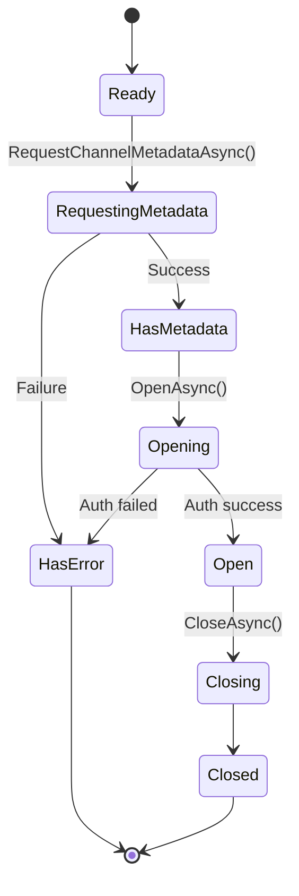

# Infrastructure / Channels

## Contents

- [Overview](#overview)
- [Files](#files)
- [Types & Members](#types--members)
- [Diagrams](#diagrams)
- [See Also](#see-also)

## Overview

Contains the abstract channel base class and interface that define channel behavior for all protocol implementations. Channels manage logical communication, subscriptions, authentication, encryption, and message routing.

## Files

| File | Primary Type | LOC (approx) | Responsibility |
|------|-------------|--------------|----------------|
| AbstractThunderPropagatorChannel.cs | AbstractThunderPropagatorChannel | ~375 | Abstract base for all channel implementations |
| IThunderPropagatorChannel.cs | IThunderPropagatorChannel | ~40 | Public channel interface |

## Types & Members

### AbstractThunderPropagatorChannel

**Kind**: Abstract class (internal)  
**Namespace**: `ThunderPropagator.Clients.DotNet.Infrastructure.Channels`  
**Implements**: `IThunderPropagatorChannel`, `INotifyPropertyChanged`

Core channel implementation providing subscription management, encryption, authentication, and message routing.

**Key Properties**:

- `Name: string` — Channel identifier
- `ChannelMetadata: ThunderPropagatorChannelMetadata?` — Channel configuration
- `ChannelStatus: ThunderPropagatorChannelState` — Current state
- `PingPongState: ThunderPropagatorPingPongState` — Health check status
- `ThunderPropagatorConnection: IThunderPropagatorConnection` — Underlying connection

**Key Methods**:

- `OpenAsync(username, password)` — Authenticate and open channel
- `SubscribeAsync(request)` — Subscribe to data stream
- `RequestChannelMetadataAsync()` — Fetch channel metadata
- `PingAsync()` — Health check
- `HandleReceivedResponse(response)` — Process server responses
- `HandleReceivedMessageAsync(message)` — Process incoming messages

**Encryption Support**:

- `BuildAuthEncryptor()` — Creates RSA encryptor for credentials
- `BuildMessageDecryptor()` — Creates RSA decryptor for messages

**Thread-safety**: Uses `BindingDictionary` for concurrent request/subscription tracking

[↑ Back to top](#contents)

---

### IThunderPropagatorChannel

**Kind**: Interface (public)  
**Namespace**: `ThunderPropagator.Clients.DotNet.Infrastructure.Channels`

Public contract for channel operations.

**Key Members**:

- `ChannelMetadata: ThunderPropagatorChannelMetadata?` — Metadata property
- `ChannelStatus: ThunderPropagatorChannelState` — State property
- `SetToken(token)` — Set OAuth2 token
- `SetAuthentication(username, password, cipheringMetadata)` — Set basic auth
- `SetMessageCipheringMetadata(metadata)` — Configure message decryption
- `RequestPingAsync()` — Send ping
- `RequestChannelMetadataAsync()` — Request metadata
- `CreateSubscription(...)` — Create subscription objects

**Events**:

- `ChannelStatusChanged` — State transition notifications
- `MetadataUpdated` — Metadata received
- `ReceivedMessage` — New message arrived

[↑ Back to top](#contents)

---

## Diagrams

### Channel State Machine

[↑ Back to top](#contents)

---

## See Also

- [Channels](../../Channels/README.md) — Protocol-specific channel implementations
- [Infrastructure](../README.md) — Parent infrastructure overview

[↑ Back to top](#contents)
