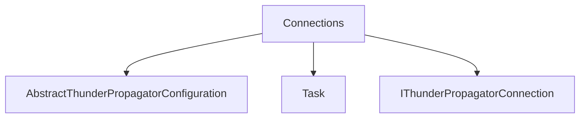

# Connections

## Contents

- [Overview](#overview)
- [Files](#files)
- [Types and Members](#types-and-members)
- [Serialization and Contracts](#serialization-and-contracts)
- [Validation and Constraints](#validation-and-constraints)
- [Performance Notes](#performance-notes)
- [Diagrams](#diagrams)
- [Examples](#examples)
- [See Also](#see-also)

## Overview

The **Connections** area groups 3 documented types, including `AbstractThunderPropagatorConfiguration`, `Task`, `IThunderPropagatorConnection`. It provides the contracts and implementation used by this part of ThunderPropagator.Clients.DotNet.

## Files

| File | Primary type(s)/symbol(s) | LOC (approx.) | Responsibility |
|---|---|---:|---|
| `AbstractThunderPropagatorConfiguration.cs` | `AbstractThunderPropagatorConfiguration` | 13 | Defines AbstractThunderPropagatorConfiguration and its related behavior. |
| `AbstractThunderPropagatorConnection.cs` | `Task`, `AbstractThunderPropagatorConnection` | 194 | Defines Task, AbstractThunderPropagatorConnection and its related behavior. |
| `IThunderPropagatorConnection.cs` | `IThunderPropagatorConnection` | 21 | Defines IThunderPropagatorConnection and its related behavior. |

## Types and Members

| Type | Kind | Summary | Inherits/Implements | Key Members |
|---|---|---|---|---|
| [`AbstractThunderPropagatorConfiguration`](#abstractthunderpropagatorconfiguration) | class | Represents the AbstractThunderPropagatorConfiguration class. | `ServiceConfiguration` | — |
| [`Task`](#task) | delegate | Represents the Task delegate. | — | `Logger`, `ConnectionConfiguration`, `ConnectionId`, `ConnectionInfo`, `OnPropertyChanged(…)`, `OnMessageReceived(…)` |
| [`IThunderPropagatorConnection`](#ithunderpropagatorconnection) | interface | Represents the IThunderPropagatorConnection interface. | `IDisposable,` | `SendAsync(…)` |

### AbstractThunderPropagatorConfiguration

- **Kind:** class
- **Namespace:** `ThunderPropagator.Clients.DotNet.Infrastructure.Connections`
- **Inherits/implements:** `ServiceConfiguration`
- **Attributes:** None detected
- **Key members:** Refer to the API surface in the source package
- **Summary:** Represents the AbstractThunderPropagatorConfiguration class.
- **Thread safety:** Follow the lifetime and concurrency guarantees of the owning component; no additional guarantee is inferred.

**Usage recipe**

```csharp
// Resolve AbstractThunderPropagatorConfiguration from the configured service container or construct it with its declared dependencies.
```

[↑ Back to top](#contents)

### Task

- **Kind:** delegate
- **Namespace:** `ThunderPropagator.Clients.DotNet.Infrastructure.Connections`
- **Inherits/implements:** None declared
- **Attributes:** None detected
- **Key members:** `Logger`, `ConnectionConfiguration`, `ConnectionId`, `ConnectionInfo`, `OnPropertyChanged(…)`, `OnMessageReceived(…)`
- **Summary:** Represents the Task delegate.
- **Thread safety:** Follow the lifetime and concurrency guarantees of the owning component; no additional guarantee is inferred.

**Usage recipe**

```csharp
// Resolve Task from the configured service container or construct it with its declared dependencies.
```

[↑ Back to top](#contents)

### IThunderPropagatorConnection

- **Kind:** interface
- **Namespace:** `ThunderPropagator.Clients.DotNet.Infrastructure.Connections`
- **Inherits/implements:** `IDisposable,`
- **Attributes:** None detected
- **Key members:** `SendAsync(…)`
- **Summary:** Represents the IThunderPropagatorConnection interface.
- **Thread safety:** Follow the lifetime and concurrency guarantees of the owning component; no additional guarantee is inferred.

**Usage recipe**

```csharp
// Resolve IThunderPropagatorConnection from the configured service container or construct it with its declared dependencies.
```

[↑ Back to top](#contents)

## Serialization and Contracts

Serialization behavior is part of the public wire or persistence contract in this area. Preserve field names, ordering rules, content negotiation, and backward-compatibility expectations when changing these types.

## Validation and Constraints

Inputs are validated at component boundaries. Callers should provide non-null required values and handle domain or argument exceptions without retrying invalid requests unchanged.

## Performance Notes

This area contains performance-sensitive constructs such as pooled buffers, spans, asynchronous value types, or concurrent collections. Avoid unnecessary allocations and blocking calls on streaming or message-processing paths.

## Diagrams

### Component overview



The diagram shows the direct components documented by the **Connections** area.

## Examples

Start with `AbstractThunderPropagatorConfiguration` as the primary entry point for this folder, then follow its linked contracts and collaborators.

## See Also

- [Parent area](../README.md)
- [Channels](../Channels/README.md)
- [Loggers](../Loggers/README.md)
- [Requests](../Requests/README.md)
- [Responses](../Responses/README.md)

[↑ Back to top](#contents)
