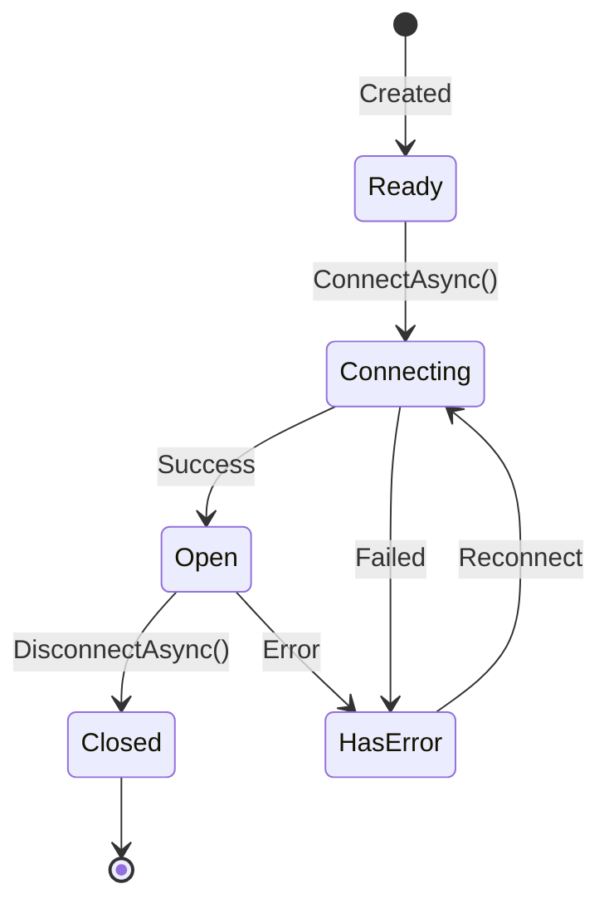

# Infrastructure / Connections

## Contents

- [Overview](#overview)
- [Files](#files)
- [Types & Members](#types--members)
- [Diagrams](#diagrams)
- [See Also](#see-also)

## Overview

Contains abstract connection base class, interface, and configuration base defining connection lifecycle, state management, and transport abstraction for all protocol implementations.

## Files

| File | Primary Type | LOC (approx) | Responsibility |
|------|-------------|--------------|----------------|
| AbstractThunderPropagatorConnection.cs | AbstractThunderPropagatorConnection<TConnectionConfiguration> | ~194 | Abstract base for all connection implementations |
| IThunderPropagatorConnection.cs | IThunderPropagatorConnection | ~20 | Public connection interface |
| AbstractThunderPropagatorConfiguration.cs | AbstractThunderPropagatorConfiguration | ~15 | Base configuration class |

## Types & Members

### AbstractThunderPropagatorConnection<TConnectionConfiguration>

**Kind**: Abstract class (internal)  
**Namespace**: `ThunderPropagator.Clients.DotNet.Infrastructure.Connections`  
**Implements**: `IThunderPropagatorConnection`, `INotifyPropertyChanged`  
**Inherits**: `DisposableObject` (from BuildingBlocks)

Core connection implementation managing lifecycle, receive loops, and state transitions.

**Key Properties**:

- `ConnectionState: ThunderPropagatorConnectionState` — Current connection state
- `ConnectionInfo: ThunderPropagatorConnectionResponse` — Server connection details
- `ConnectionId: string` — Unique connection identifier

**Abstract Methods** (protocol-specific):

- `InternalConnectAsync()` — Establish transport connection
- `InternalDisconnectAsync()` — Close transport connection
- `ReceiveAsync()` — Read next message from transport
- `InternalSendAsync()` — Write message to transport

**Concrete Methods**:

- `ConnectAsync()` — Public connect with state management and 24h receive loop
- `DisconnectAsync()` — Public disconnect
- `OnMessageReceived(message)` — Filters PROBE, parses ConnectionResponse, raises MessageReceived

**Features**:

- Auto-reconnection support with 24-hour timeout
- Semaphore protection for connect/disconnect
- PROBE message filtering
- First message as `ThunderPropagatorConnectionResponse`

**Thread-safety**: Semaphore-protected state transitions

[↑ Back to top](#contents)

---

### IThunderPropagatorConnection

**Kind**: Interface (public)  
**Namespace**: `ThunderPropagator.Clients.DotNet.Infrastructure.Connections`  
**Implements**: `IDisposable`, `IAsyncDisposable`

Public contract for connection operations.

**Members**:

- `ConnectionId: string` — Connection identifier
- `ConnectionState: ThunderPropagatorConnectionState` — Current state
- `ConnectionInfo: ThunderPropagatorConnectionResponse` — Connection details
- `ConnectAsync()` — Establish connection
- `DisconnectAsync()` — Close connection
- `SendAsync(message)` — Send message (internal visibility)

**Events**:

- `ConnectionStateChanged` — State transitions
- `MessageReceived` — New message (async Task-based)

[↑ Back to top](#contents)

---

### AbstractThunderPropagatorConfiguration

**Kind**: Abstract class (public)  
**Namespace**: `ThunderPropagator.Clients.DotNet.Infrastructure.Connections`  
**Inherits**: `ServiceConfiguration` (from BuildingBlocks)

Base configuration for all protocol configurations.

**Key Properties**:

- `Uri: string` — Server URI (required for most protocols)

Uses Get/Set pattern:

```csharp
public string Uri
{
    get => Get<string>()!;
    set => Set(value);
}
```

[↑ Back to top](#contents)

---

## Diagrams

### Connection State Transitions



[↑ Back to top](#contents)

---

## See Also

- [Connections](../../Connections/README.md) — Protocol-specific connection implementations
- [Infrastructure](../README.md) — Parent infrastructure overview

[↑ Back to top](#contents)
