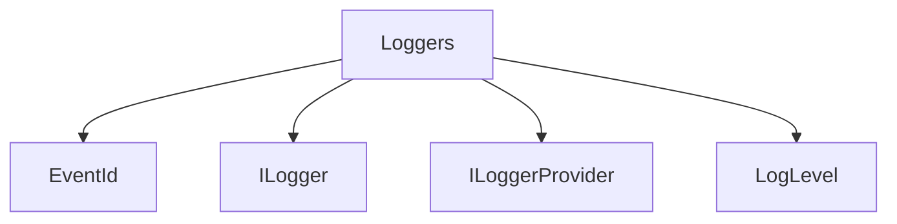

# Loggers

## Contents

- [Overview](#overview)
- [Files](#files)
- [Types and Members](#types-and-members)
- [Diagrams](#diagrams)
- [Examples](#examples)
- [See Also](#see-also)

## Overview

The **Loggers** area groups 4 documented types, including `EventId`, `ILogger`, `ILoggerProvider`, `LogLevel`. It provides the contracts and implementation used by this part of ThunderPropagator.Clients.DotNet.

## Files

| File | Primary type(s)/symbol(s) | LOC (approx.) | Responsibility |
|---|---|---:|---|
| `EventId.cs` | `EventId` | 65 | Defines EventId and its related behavior. |
| `ILogger.cs` | `ILogger` | 28 | Defines ILogger and its related behavior. |
| `ILoggerProvider.cs` | `ILoggerProvider` | 7 | Defines ILoggerProvider and its related behavior. |
| `LogLevel.cs` | `LogLevel` | 46 | Defines LogLevel and its related behavior. |

## Types and Members

| Type | Kind | Summary | Inherits/Implements | Key Members |
|---|---|---|---|---|
| [`EventId`](#eventid) | struct | Identifies a logging event. The primary identifier is the "Id" property, with the "Name" property providing a short description of this type of event. | `IEquatable<EventId>` | `EventId(…)`, `Id`, `Name`, `ToString(…)`, `Equals(…)`, `Equals(…)` |
| [`ILogger`](#ilogger) | interface | Represents a type used to perform logging. | — | — |
| [`ILoggerProvider`](#iloggerprovider) | interface | Represents the ILoggerProvider interface. | `IDisposable` | — |
| [`LogLevel`](#loglevel) | enum | Defines logging severity levels. | — | — |

### EventId

- **Kind:** struct
- **Namespace:** `ThunderPropagator.Clients.DotNet.Infrastructure.Loggers`
- **Inherits/implements:** `IEquatable<EventId>`
- **Attributes:** None detected
- **Key members:** `EventId(…)`, `Id`, `Name`, `ToString(…)`, `Equals(…)`, `Equals(…)`, `GetHashCode(…)`
- **Summary:** Identifies a logging event. The primary identifier is the "Id" property, with the "Name" property providing a short description of this type of event.
- **Thread safety:** Follow the lifetime and concurrency guarantees of the owning component; no additional guarantee is inferred.

**Usage recipe**

```csharp
// Resolve EventId from the configured service container or construct it with its declared dependencies.
```

[↑ Back to top](#contents)

### ILogger

- **Kind:** interface
- **Namespace:** `ThunderPropagator.Clients.DotNet.Infrastructure.Loggers`
- **Inherits/implements:** None declared
- **Attributes:** None detected
- **Key members:** Refer to the API surface in the source package
- **Summary:** Represents a type used to perform logging.
- **Thread safety:** Follow the lifetime and concurrency guarantees of the owning component; no additional guarantee is inferred.

**Usage recipe**

```csharp
// Resolve ILogger from the configured service container or construct it with its declared dependencies.
```

[↑ Back to top](#contents)

### ILoggerProvider

- **Kind:** interface
- **Namespace:** `ThunderPropagator.Clients.DotNet.Infrastructure.Loggers`
- **Inherits/implements:** `IDisposable`
- **Attributes:** None detected
- **Key members:** Refer to the API surface in the source package
- **Summary:** Represents the ILoggerProvider interface.
- **Thread safety:** Follow the lifetime and concurrency guarantees of the owning component; no additional guarantee is inferred.

**Usage recipe**

```csharp
// Resolve ILoggerProvider from the configured service container or construct it with its declared dependencies.
```

[↑ Back to top](#contents)

### LogLevel

- **Kind:** enum
- **Namespace:** `ThunderPropagator.Clients.DotNet.Infrastructure.Loggers`
- **Inherits/implements:** None declared
- **Attributes:** None detected
- **Key members:** Refer to the API surface in the source package
- **Summary:** Defines logging severity levels.
- **Thread safety:** Follow the lifetime and concurrency guarantees of the owning component; no additional guarantee is inferred.

**Usage recipe**

```csharp
// Resolve LogLevel from the configured service container or construct it with its declared dependencies.
```

[↑ Back to top](#contents)

## Diagrams

### Component overview



The diagram shows the direct components documented by the **Loggers** area.

## Examples

Start with `EventId` as the primary entry point for this folder, then follow its linked contracts and collaborators.

## See Also

- [Parent area](../README.md)
- [Channels](../Channels/README.md)
- [Connections](../Connections/README.md)
- [Requests](../Requests/README.md)
- [Responses](../Responses/README.md)

[↑ Back to top](#contents)
