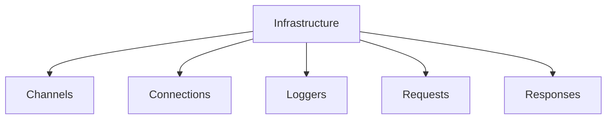

# Infrastructure

## Contents

- [Overview](#overview)
- [Files](#files)
- [Diagrams](#diagrams)
- [Examples](#examples)
- [See Also](#see-also)

## Overview

The **Infrastructure** area organizes 5 direct sub-areas. Each child is documented separately so responsibilities and APIs remain easy to navigate.

## Files

*None.*

### Direct child areas

- [Channels](./Channels/README.md) `Types:5` `Files:2`
- [Connections](./Connections/README.md) `Types:3` `Files:3`
- [Loggers](./Loggers/README.md) `Types:4` `Files:4`
- [Requests](./Requests/README.md) `Types:1` `Files:2`
- [Responses](./Responses/README.md) `Types:1` `Files:1`

## Diagrams

### Component overview

The diagram shows the direct components documented by the **Infrastructure** area.

## Examples

Choose the child area that matches the required capability; parent documentation intentionally does not duplicate child implementation details.

## See Also

- [Documentation home](../README.md)
- [Channels](../Channels/README.md)
- [Clients](../Clients/README.md)
- [Connections](../Connections/README.md)
- [Models](../Models/README.md)
- [instructions](../instructions/README.md)

[↑ Back to top](#contents)
