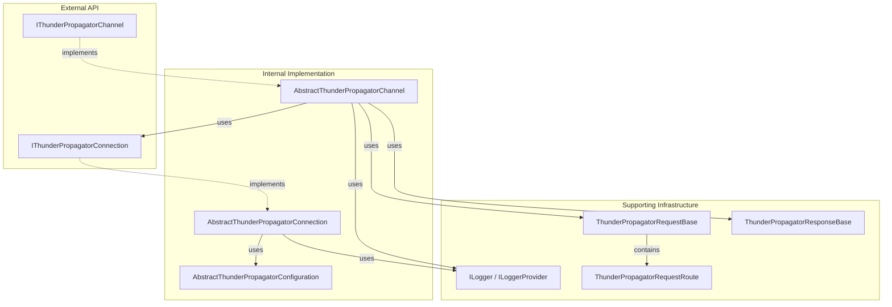

# Infrastructure

## Contents

- [Overview](#overview)
- [Subfolders](#subfolders)
- [Diagrams](#diagrams)
  - [Infrastructure Overview](#infrastructure-overview)
- [Design Patterns](#design-patterns)
- [See Also](#see-also)

## Overview

The Infrastructure folder contains core abstractions, base implementations, and supporting utilities for the ThunderPropagator client library. It defines the foundational patterns used throughout the codebase including connection management, channel operations, logging, and request/response handling.

All infrastructure components follow consistent design patterns:
- Abstract base classes with `internal abstract` visibility
- Public interfaces for external consumption
- `INotifyPropertyChanged` implementation for state tracking
- Conditional sealing (`#if !DEBUG sealed #endif`)
- Configuration via Get/Set pattern from BuildingBlocks

## Subfolders

### [Channels](./Channels/README.md)
Abstract channel base class and interface defining channel behavior, subscriptions, encryption, and message handling.

`Types:2` `Files:2` `Diagrams:✓`

### [Connections](./Connections/README.md)
Abstract connection base class, interface, and configuration base defining connection lifecycle, state management, and transport abstraction.

`Types:3` `Files:3` `Diagrams:✓`

### [Loggers](./Loggers/README.md)
Custom lightweight logging abstraction providing `ILogger`, `ILoggerProvider`, `LogLevel`, and `EventId` types. **Does not use Microsoft.Extensions.Logging**.

`Types:4` `Files:4` `Diagrams:✗`

### [Requests](./Requests/README.md)
Base request classes and routing structures for channel operations including metadata requests, subscriptions, pings, and custom requests.

`Types:2` `Files:2` `Diagrams:✗`

### [Responses](./Responses/README.md)
Base response class for handling server responses to client requests.

`Types:1` `Files:1` `Diagrams:✗`

## Diagrams

### Infrastructure Overview



This diagram shows the infrastructure layers: public interfaces, internal abstractions, and supporting utilities.

[↑ Back to top](#contents)

---

## Design Patterns

### Configuration Pattern

All configurations extend `AbstractThunderPropagatorConfiguration` which extends BuildingBlocks' `ServiceConfiguration`:

```csharp
public class MyConfiguration : AbstractThunderPropagatorConfiguration
{
    public int BufferSize
    {
        get => Get(4096);  // Default value
        set => Set(value);
    }
}
```

Uses dictionary-based storage with type-safe getters/setters.

### Abstract Base Pattern

Core functionality lives in abstract internal classes:

```csharp
internal abstract class AbstractThunderPropagatorConnection<TConfig> 
    : IThunderPropagatorConnection
{
    // Common implementation
    protected abstract Task InternalConnectAsync(...);
    protected abstract Task InternalSendAsync(...);
}
```

Protocol-specific classes implement abstract methods while inheriting common behavior.

### Property Change Notification

All major components implement `INotifyPropertyChanged`:

```csharp
protected bool SetField<T>(ref T field, T value, 
    [CallerMemberName] string? propertyName = null)
{
    if (EqualityComparer<T>.Default.Equals(field, value))
        return false;
    field = value;
    OnPropertyChanged(propertyName);
    return true;
}
```

### Event-Based Communication

Typed delegates for all events (not generic `EventHandler<T>`):

```csharp
public delegate void ThunderPropagatorConnectionStateChangedEventHandler(
    object sender, 
    ThunderPropagatorConnectionState state, 
    EventArgs args);

public delegate Task ThunderPropagatorMessageReceivedEventHandler(
    object sender, 
    string message, 
    CancellationToken cancellationToken = default);
```

[↑ Back to top](#contents)

---

## See Also

- [Clients](../Clients/README.md) — Client facades using infrastructure
- [Channels](../Channels/README.md) — Protocol-specific channels
- [Connections](../Connections/README.md) — Protocol-specific connections
- [Models](../Models/README.md) — Data models and enumerations

[↑ Back to top](#contents)
