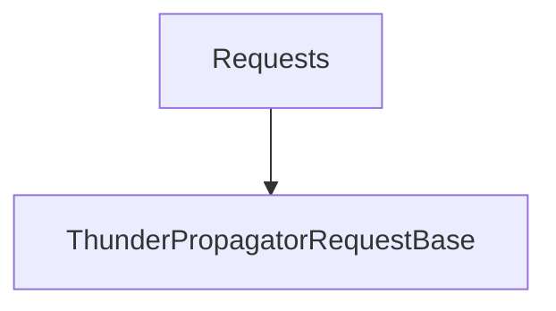

# Requests

## Contents

- [Overview](#overview)
- [Files](#files)
- [Types and Members](#types-and-members)
- [Diagrams](#diagrams)
- [Examples](#examples)
- [See Also](#see-also)

## Overview

The **Requests** area groups 1 documented type, including `ThunderPropagatorRequestBase`. It provides the contracts and implementation used by this part of ThunderPropagator.Clients.DotNet.

## Files

| File | Primary type(s)/symbol(s) | LOC (approx.) | Responsibility |
|---|---|---:|---|
| `ThunderPropagatorRequestBase.cs` | `ThunderPropagatorRequestBase` | 47 | Defines ThunderPropagatorRequestBase and its related behavior. |
| `ThunderPropagatorRequestRoute.cs` | `ThunderPropagatorRequestRoute` | 18 | Defines ThunderPropagatorRequestRoute and its related behavior. |

## Types and Members

| Type | Kind | Summary | Inherits/Implements | Key Members |
|---|---|---|---|---|
| [`ThunderPropagatorRequestBase`](#thunderpropagatorrequestbase) | class | Represents the ThunderPropagatorRequestBase class. | `DisposableObject` | `RequestId`, `Route`, `Token`, `Username`, `Password`, `Awaitable` |

### ThunderPropagatorRequestBase

- **Kind:** class
- **Namespace:** `ThunderPropagator.Clients.DotNet.Infrastructure.Requests`
- **Inherits/implements:** `DisposableObject`
- **Attributes:** None detected
- **Key members:** `RequestId`, `Route`, `Token`, `Username`, `Password`, `Awaitable`, `SetAwaitable(…)`, `SetRequestTimeout(…)`
- **Summary:** Represents the ThunderPropagatorRequestBase class.
- **Thread safety:** Follow the lifetime and concurrency guarantees of the owning component; no additional guarantee is inferred.

**Usage recipe**

```csharp
// Resolve ThunderPropagatorRequestBase from the configured service container or construct it with its declared dependencies.
```

[↑ Back to top](#contents)

## Diagrams

### Component overview



The diagram shows the direct components documented by the **Requests** area.

## Examples

Start with `ThunderPropagatorRequestBase` as the primary entry point for this folder, then follow its linked contracts and collaborators.

## See Also

- [Parent area](../README.md)
- [Channels](../Channels/README.md)
- [Connections](../Connections/README.md)
- [Loggers](../Loggers/README.md)
- [Responses](../Responses/README.md)

[↑ Back to top](#contents)
