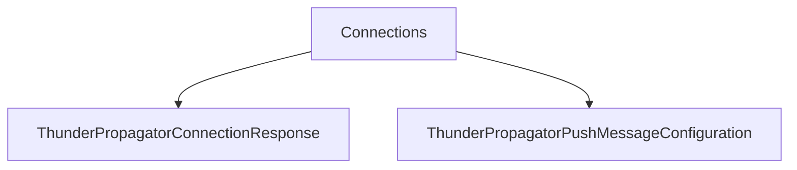

# Connections

## Contents

- [Overview](#overview)
- [Files](#files)
- [Types and Members](#types-and-members)
- [Serialization and Contracts](#serialization-and-contracts)
- [Diagrams](#diagrams)
- [Examples](#examples)
- [See Also](#see-also)

## Overview

The **Connections** area groups 2 documented types, including `ThunderPropagatorConnectionResponse`, `ThunderPropagatorPushMessageConfiguration`. It provides the contracts and implementation used by this part of ThunderPropagator.Clients.DotNet.

## Files

| File | Primary type(s)/symbol(s) | LOC (approx.) | Responsibility |
|---|---|---:|---|
| `ThunderPropagatorConnectionResponse.cs` | `ThunderPropagatorConnectionResponse` | 18 | Defines ThunderPropagatorConnectionResponse and its related behavior. |
| `ThunderPropagatorPushMessageConfiguration.cs` | `ThunderPropagatorPushMessageConfiguration` | 23 | Defines ThunderPropagatorPushMessageConfiguration and its related behavior. |

## Types and Members

| Type | Kind | Summary | Inherits/Implements | Key Members |
|---|---|---|---|---|
| [`ThunderPropagatorConnectionResponse`](#thunderpropagatorconnectionresponse) | class | Represents the ThunderPropagatorConnectionResponse class. | — | — |
| [`ThunderPropagatorPushMessageConfiguration`](#thunderpropagatorpushmessageconfiguration) | class | Represents the ThunderPropagatorPushMessageConfiguration class. | `ServiceConfiguration` | `Path`, `BufferSize`, `SubProtocol`, `DangerousEnableCompression`, `DisableServerContextTakeover`, `ServerMaxWindowBits` |

### ThunderPropagatorConnectionResponse

- **Kind:** class
- **Namespace:** `ThunderPropagator.Clients.DotNet.Models.Connections`
- **Inherits/implements:** None declared
- **Attributes:** None detected
- **Key members:** Refer to the API surface in the source package
- **Summary:** Represents the ThunderPropagatorConnectionResponse class.
- **Thread safety:** Follow the lifetime and concurrency guarantees of the owning component; no additional guarantee is inferred.

**Usage recipe**

```csharp
// Resolve ThunderPropagatorConnectionResponse from the configured service container or construct it with its declared dependencies.
```

[↑ Back to top](#contents)

### ThunderPropagatorPushMessageConfiguration

- **Kind:** class
- **Namespace:** `ThunderPropagator.Clients.DotNet.Models.Connections`
- **Inherits/implements:** `ServiceConfiguration`
- **Attributes:** None detected
- **Key members:** `Path`, `BufferSize`, `SubProtocol`, `DangerousEnableCompression`, `DisableServerContextTakeover`, `ServerMaxWindowBits`, `MaxRequestSize`, `MaxPushSize`
- **Summary:** Represents the ThunderPropagatorPushMessageConfiguration class.
- **Thread safety:** Follow the lifetime and concurrency guarantees of the owning component; no additional guarantee is inferred.

**Usage recipe**

```csharp
// Resolve ThunderPropagatorPushMessageConfiguration from the configured service container or construct it with its declared dependencies.
```

[↑ Back to top](#contents)

## Serialization and Contracts

Serialization behavior is part of the public wire or persistence contract in this area. Preserve field names, ordering rules, content negotiation, and backward-compatibility expectations when changing these types.

## Diagrams

### Component overview



The diagram shows the direct components documented by the **Connections** area.

## Examples

Start with `ThunderPropagatorConnectionResponse` as the primary entry point for this folder, then follow its linked contracts and collaborators.

## See Also

- [Parent area](../README.md)
- [Enums](../Enums/README.md)
- [Metadata](../Metadata/README.md)
- [ReceivedMessage](../ReceivedMessage/README.md)
- [Requests](../Requests/README.md)
- [Subscriptions](../Subscriptions/README.md)

[↑ Back to top](#contents)
