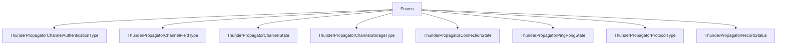

# Enums

## Contents

- [Overview](#overview)
- [Files](#files)
- [Types and Members](#types-and-members)
- [Serialization and Contracts](#serialization-and-contracts)
- [Diagrams](#diagrams)
- [Examples](#examples)
- [See Also](#see-also)

## Overview

The **Enums** area groups 10 documented types, including `ThunderPropagatorChannelAuthenticationType`, `ThunderPropagatorChannelFieldType`, `ThunderPropagatorChannelState`, `ThunderPropagatorChannelStorageType`, `ThunderPropagatorConnectionState`. It provides the contracts and implementation used by this part of ThunderPropagator.Clients.DotNet.

## Files

| File | Primary type(s)/symbol(s) | LOC (approx.) | Responsibility |
|---|---|---:|---|
| `ThunderPropagatorChannelAuthenticationType.cs` | `ThunderPropagatorChannelAuthenticationType` | 9 | Defines ThunderPropagatorChannelAuthenticationType and its related behavior. |
| `ThunderPropagatorChannelFieldType.cs` | `ThunderPropagatorChannelFieldType` | 16 | Defines ThunderPropagatorChannelFieldType and its related behavior. |
| `ThunderPropagatorChannelState.cs` | `ThunderPropagatorChannelState` | 10 | Defines ThunderPropagatorChannelState and its related behavior. |
| `ThunderPropagatorChannelStorageType.cs` | `ThunderPropagatorChannelStorageType` | 9 | Defines ThunderPropagatorChannelStorageType and its related behavior. |
| `ThunderPropagatorConnectionState.cs` | `ThunderPropagatorConnectionState` | 12 | Defines ThunderPropagatorConnectionState and its related behavior. |
| `ThunderPropagatorPingPongState.cs` | `ThunderPropagatorPingPongState` | 10 | Defines ThunderPropagatorPingPongState and its related behavior. |
| `ThunderPropagatorProtocolType.cs` | `ThunderPropagatorProtocolType` | 10 | Defines ThunderPropagatorProtocolType and its related behavior. |
| `ThunderPropagatorRecordStatus.cs` | `ThunderPropagatorRecordStatus` | 10 | Defines ThunderPropagatorRecordStatus and its related behavior. |
| `ThunderPropagatorSubscriptionMode.cs` | `ThunderPropagatorSubscriptionMode` | 8 | Defines ThunderPropagatorSubscriptionMode and its related behavior. |
| `ThunderPropagatorSubscriptionStatus.cs` | `ThunderPropagatorSubscriptionStatus` | 12 | Defines ThunderPropagatorSubscriptionStatus and its related behavior. |

## Types and Members

| Type | Kind | Summary | Inherits/Implements | Key Members |
|---|---|---|---|---|
| [`ThunderPropagatorChannelAuthenticationType`](#thunderpropagatorchannelauthenticationtype) | enum | Represents the ThunderPropagatorChannelAuthenticationType enum. | — | — |
| [`ThunderPropagatorChannelFieldType`](#thunderpropagatorchannelfieldtype) | enum | Represents the ThunderPropagatorChannelFieldType enum. | — | — |
| [`ThunderPropagatorChannelState`](#thunderpropagatorchannelstate) | enum | Represents the ThunderPropagatorChannelState enum. | — | — |
| [`ThunderPropagatorChannelStorageType`](#thunderpropagatorchannelstoragetype) | enum | Represents the ThunderPropagatorChannelStorageType enum. | — | — |
| [`ThunderPropagatorConnectionState`](#thunderpropagatorconnectionstate) | enum | Represents the ThunderPropagatorConnectionState enum. | — | — |
| [`ThunderPropagatorPingPongState`](#thunderpropagatorpingpongstate) | enum | Represents the ThunderPropagatorPingPongState enum. | — | — |
| [`ThunderPropagatorProtocolType`](#thunderpropagatorprotocoltype) | enum | Represents the ThunderPropagatorProtocolType enum. | — | — |
| [`ThunderPropagatorRecordStatus`](#thunderpropagatorrecordstatus) | enum | Represents the ThunderPropagatorRecordStatus enum. | — | — |
| [`ThunderPropagatorSubscriptionMode`](#thunderpropagatorsubscriptionmode) | enum | Represents the ThunderPropagatorSubscriptionMode enum. | — | — |
| [`ThunderPropagatorSubscriptionStatus`](#thunderpropagatorsubscriptionstatus) | enum | Represents the ThunderPropagatorSubscriptionStatus enum. | — | — |

### ThunderPropagatorChannelAuthenticationType

- **Kind:** enum
- **Namespace:** `ThunderPropagator.Clients.DotNet.Models.Enums`
- **Inherits/implements:** None declared
- **Attributes:** None detected
- **Key members:** Refer to the API surface in the source package
- **Summary:** Represents the ThunderPropagatorChannelAuthenticationType enum.
- **Thread safety:** Follow the lifetime and concurrency guarantees of the owning component; no additional guarantee is inferred.

**Usage recipe**

```csharp
// Resolve ThunderPropagatorChannelAuthenticationType from the configured service container or construct it with its declared dependencies.
```

[↑ Back to top](#contents)

### ThunderPropagatorChannelFieldType

- **Kind:** enum
- **Namespace:** `ThunderPropagator.Clients.DotNet.Models.Enums`
- **Inherits/implements:** None declared
- **Attributes:** None detected
- **Key members:** Refer to the API surface in the source package
- **Summary:** Represents the ThunderPropagatorChannelFieldType enum.
- **Thread safety:** Follow the lifetime and concurrency guarantees of the owning component; no additional guarantee is inferred.

**Usage recipe**

```csharp
// Resolve ThunderPropagatorChannelFieldType from the configured service container or construct it with its declared dependencies.
```

[↑ Back to top](#contents)

### ThunderPropagatorChannelState

- **Kind:** enum
- **Namespace:** `ThunderPropagator.Clients.DotNet.Models.Enums`
- **Inherits/implements:** None declared
- **Attributes:** None detected
- **Key members:** Refer to the API surface in the source package
- **Summary:** Represents the ThunderPropagatorChannelState enum.
- **Thread safety:** Follow the lifetime and concurrency guarantees of the owning component; no additional guarantee is inferred.

**Usage recipe**

```csharp
// Resolve ThunderPropagatorChannelState from the configured service container or construct it with its declared dependencies.
```

[↑ Back to top](#contents)

### ThunderPropagatorChannelStorageType

- **Kind:** enum
- **Namespace:** `ThunderPropagator.Clients.DotNet.Models.Enums`
- **Inherits/implements:** None declared
- **Attributes:** None detected
- **Key members:** Refer to the API surface in the source package
- **Summary:** Represents the ThunderPropagatorChannelStorageType enum.
- **Thread safety:** Follow the lifetime and concurrency guarantees of the owning component; no additional guarantee is inferred.

**Usage recipe**

```csharp
// Resolve ThunderPropagatorChannelStorageType from the configured service container or construct it with its declared dependencies.
```

[↑ Back to top](#contents)

### ThunderPropagatorConnectionState

- **Kind:** enum
- **Namespace:** `ThunderPropagator.Clients.DotNet.Models.Enums`
- **Inherits/implements:** None declared
- **Attributes:** None detected
- **Key members:** Refer to the API surface in the source package
- **Summary:** Represents the ThunderPropagatorConnectionState enum.
- **Thread safety:** Follow the lifetime and concurrency guarantees of the owning component; no additional guarantee is inferred.

**Usage recipe**

```csharp
// Resolve ThunderPropagatorConnectionState from the configured service container or construct it with its declared dependencies.
```

[↑ Back to top](#contents)

### ThunderPropagatorPingPongState

- **Kind:** enum
- **Namespace:** `ThunderPropagator.Clients.DotNet.Models.Enums`
- **Inherits/implements:** None declared
- **Attributes:** None detected
- **Key members:** Refer to the API surface in the source package
- **Summary:** Represents the ThunderPropagatorPingPongState enum.
- **Thread safety:** Follow the lifetime and concurrency guarantees of the owning component; no additional guarantee is inferred.

**Usage recipe**

```csharp
// Resolve ThunderPropagatorPingPongState from the configured service container or construct it with its declared dependencies.
```

[↑ Back to top](#contents)

### ThunderPropagatorProtocolType

- **Kind:** enum
- **Namespace:** `ThunderPropagator.Clients.DotNet.Models.Enums`
- **Inherits/implements:** None declared
- **Attributes:** None detected
- **Key members:** Refer to the API surface in the source package
- **Summary:** Represents the ThunderPropagatorProtocolType enum.
- **Thread safety:** Follow the lifetime and concurrency guarantees of the owning component; no additional guarantee is inferred.

**Usage recipe**

```csharp
// Resolve ThunderPropagatorProtocolType from the configured service container or construct it with its declared dependencies.
```

[↑ Back to top](#contents)

### ThunderPropagatorRecordStatus

- **Kind:** enum
- **Namespace:** `ThunderPropagator.Clients.DotNet.Models.Enums`
- **Inherits/implements:** None declared
- **Attributes:** None detected
- **Key members:** Refer to the API surface in the source package
- **Summary:** Represents the ThunderPropagatorRecordStatus enum.
- **Thread safety:** Follow the lifetime and concurrency guarantees of the owning component; no additional guarantee is inferred.

**Usage recipe**

```csharp
// Resolve ThunderPropagatorRecordStatus from the configured service container or construct it with its declared dependencies.
```

[↑ Back to top](#contents)

### ThunderPropagatorSubscriptionMode

- **Kind:** enum
- **Namespace:** `ThunderPropagator.Clients.DotNet.Models.Enums`
- **Inherits/implements:** None declared
- **Attributes:** None detected
- **Key members:** Refer to the API surface in the source package
- **Summary:** Represents the ThunderPropagatorSubscriptionMode enum.
- **Thread safety:** Follow the lifetime and concurrency guarantees of the owning component; no additional guarantee is inferred.

**Usage recipe**

```csharp
// Resolve ThunderPropagatorSubscriptionMode from the configured service container or construct it with its declared dependencies.
```

[↑ Back to top](#contents)

### ThunderPropagatorSubscriptionStatus

- **Kind:** enum
- **Namespace:** `ThunderPropagator.Clients.DotNet.Models.Enums`
- **Inherits/implements:** None declared
- **Attributes:** None detected
- **Key members:** Refer to the API surface in the source package
- **Summary:** Represents the ThunderPropagatorSubscriptionStatus enum.
- **Thread safety:** Follow the lifetime and concurrency guarantees of the owning component; no additional guarantee is inferred.

**Usage recipe**

```csharp
// Resolve ThunderPropagatorSubscriptionStatus from the configured service container or construct it with its declared dependencies.
```

[↑ Back to top](#contents)

## Serialization and Contracts

Serialization behavior is part of the public wire or persistence contract in this area. Preserve field names, ordering rules, content negotiation, and backward-compatibility expectations when changing these types.

## Diagrams

### Component overview



The diagram shows the direct components documented by the **Enums** area.

## Examples

Start with `ThunderPropagatorChannelAuthenticationType` as the primary entry point for this folder, then follow its linked contracts and collaborators.

## See Also

- [Parent area](../README.md)
- [Connections](../Connections/README.md)
- [Metadata](../Metadata/README.md)
- [ReceivedMessage](../ReceivedMessage/README.md)
- [Requests](../Requests/README.md)
- [Subscriptions](../Subscriptions/README.md)

[↑ Back to top](#contents)
