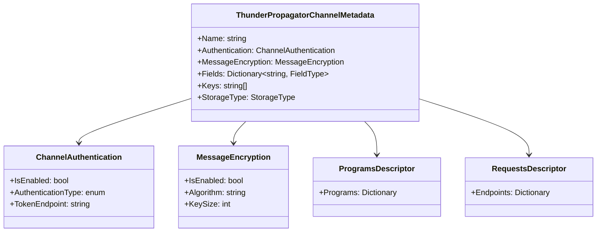

# Models / Metadata

## Contents

- [Overview](#overview)
- [Files](#files)
- [Key Types](#key-types)
- [Diagrams](#diagrams)
- [See Also](#see-also)

## Overview

Channel metadata structures describing authentication, authorization, encryption, programs (stored procedures), requests (custom endpoints), and snapshot configurations for ThunderPropagator channels.

## Files

| File | Primary Type | LOC (approx) | Responsibility |
|------|-------------|--------------|----------------|
| ThunderPropagatorChannelMetadata.cs | ThunderPropagatorChannelMetadata | ~40 | Comprehensive channel configuration |
| ThunderPropagatorChannelAuthentication.cs | ThunderPropagatorChannelAuthentication | ~20 | Authentication settings |
| ThunderPropagatorChannelAuthorization.cs | ThunderPropagatorChannelAuthorization | ~20 | Authorization settings |
| ThunderPropagatorChannelMessageEncryption.cs | ThunderPropagatorChannelMessageEncryption | ~15 | Message encryption config |
| ThunderPropagatorChannelProgramsDescriptor.cs | ThunderPropagatorChannelProgramsDescriptor | ~15 | Available stored procedures |
| ThunderPropagatorChannelRequestsDescriptor.cs | ThunderPropagatorChannelRequestsDescriptor | ~15 | Available custom endpoints |
| ThunderPropagatorChannelSnapshot.cs | ThunderPropagatorChannelSnapshot | ~20 | Snapshot configuration |

## Key Types

### ThunderPropagatorChannelMetadata

**Namespace**: `ThunderPropagator.Clients.DotNet.Models.Metadata`

Comprehensive channel configuration containing all metadata for a channel.

**Key Properties**:

- `Name: string` — Channel name
- `Authentication: ThunderPropagatorChannelAuthentication` — Auth configuration
- `Authorization: ThunderPropagatorChannelAuthorization?` — Authz rules
- `MessageEncryption: ThunderPropagatorChannelMessageEncryption` — Encryption settings
- `ProgramsDescriptor: ThunderPropagatorChannelProgramsDescriptor?` — Available programs
- `RequestsDescriptor: ThunderPropagatorChannelRequestsDescriptor?` — Available endpoints
- `Snapshot: ThunderPropagatorChannelSnapshot?` — Snapshot settings
- `Fields: Dictionary<string, ThunderPropagatorChannelFieldType>` — Schema fields
- `Keys: string[]` — Primary key fields
- `StorageType: ThunderPropagatorChannelStorageType` — Storage backend

### ThunderPropagatorChannelAuthentication

**Namespace**: `ThunderPropagator.Clients.DotNet.Models.Metadata`

Authentication configuration for a channel.

**Key Properties**:

- `IsEnabled: bool` — Whether authentication is required
- `AuthenticationType: ThunderPropagatorChannelAuthenticationType` — Method (None/Basic/OAuth2)
- `TokenEndpoint: string?` — OAuth2 token endpoint
- `Scopes: string[]?` — OAuth2 scopes

### ThunderPropagatorChannelMessageEncryption

**Namespace**: `ThunderPropagator.Clients.DotNet.Models.Metadata`

Message encryption configuration.

**Key Properties**:

- `IsEnabled: bool` — Whether messages are encrypted
- `Algorithm: string` — Encryption algorithm (e.g., "RSA")
- `KeySize: int` — Key size in bits

### ThunderPropagatorChannelProgramsDescriptor

**Namespace**: `ThunderPropagator.Clients.DotNet.Models.Metadata`

Describes available server-side programs (stored procedures/functions).

**Key Properties**:

- `Programs: Dictionary<string, ProgramInfo>` — Available programs with metadata

### ThunderPropagatorChannelRequestsDescriptor

**Namespace**: `ThunderPropagator.Clients.DotNet.Models.Metadata`

Describes available custom request endpoints.

**Key Properties**:

- `Endpoints: Dictionary<string, EndpointInfo>` — Available endpoints with metadata

### ThunderPropagatorChannelSnapshot

**Namespace**: `ThunderPropagator.Clients.DotNet.Models.Metadata`

Snapshot behavior configuration.

**Key Properties**:

- `Enabled: bool` — Whether snapshots are available
- `Interval: TimeSpan?` — Snapshot interval
- `RetentionPolicy: string?` — How long snapshots are kept

[↑ Back to top](#contents)

---

## Diagrams

### Channel Metadata Structure

Shows the composition of channel metadata with authentication, encryption, and descriptor components.

[↑ Back to top](#contents)

---

## See Also

- [Models](../README.md) — Parent models overview
- [Infrastructure/Channels](../../Infrastructure/Channels/README.md) — Channels using metadata

[↑ Back to top](#contents)
