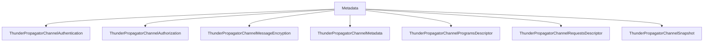

# Metadata

## Contents

- [Overview](#overview)
- [Files](#files)
- [Types and Members](#types-and-members)
- [Serialization and Contracts](#serialization-and-contracts)
- [Diagrams](#diagrams)
- [Examples](#examples)
- [See Also](#see-also)

## Overview

The **Metadata** area groups 7 documented types, including `ThunderPropagatorChannelAuthentication`, `ThunderPropagatorChannelAuthorization`, `ThunderPropagatorChannelMessageEncryption`, `ThunderPropagatorChannelMetadata`, `ThunderPropagatorChannelProgramsDescriptor`. It provides the contracts and implementation used by this part of ThunderPropagator.Clients.DotNet.

## Files

| File | Primary type(s)/symbol(s) | LOC (approx.) | Responsibility |
|---|---|---:|---|
| `ThunderPropagatorChannelAuthentication.cs` | `ThunderPropagatorChannelAuthentication` | 20 | Defines ThunderPropagatorChannelAuthentication and its related behavior. |
| `ThunderPropagatorChannelAuthorization.cs` | `ThunderPropagatorChannelAuthorization` | 15 | Defines ThunderPropagatorChannelAuthorization and its related behavior. |
| `ThunderPropagatorChannelMessageEncryption.cs` | `ThunderPropagatorChannelMessageEncryption` | 15 | Defines ThunderPropagatorChannelMessageEncryption and its related behavior. |
| `ThunderPropagatorChannelMetadata.cs` | `ThunderPropagatorChannelMetadata` | 45 | Defines ThunderPropagatorChannelMetadata and its related behavior. |
| `ThunderPropagatorChannelProgramsDescriptor.cs` | `ThunderPropagatorChannelProgramsDescriptor` | 40 | Defines ThunderPropagatorChannelProgramsDescriptor and its related behavior. |
| `ThunderPropagatorChannelRequestsDescriptor.cs` | `ThunderPropagatorChannelRequestsDescriptor` | 24 | Defines ThunderPropagatorChannelRequestsDescriptor and its related behavior. |
| `ThunderPropagatorChannelSnapshot.cs` | `ThunderPropagatorChannelSnapshot` | 35 | Defines ThunderPropagatorChannelSnapshot and its related behavior. |

## Types and Members

| Type | Kind | Summary | Inherits/Implements | Key Members |
|---|---|---|---|---|
| [`ThunderPropagatorChannelAuthentication`](#thunderpropagatorchannelauthentication) | class | Represents the ThunderPropagatorChannelAuthentication class. | — | `IsEnabled`, `AuthenticationType` |
| [`ThunderPropagatorChannelAuthorization`](#thunderpropagatorchannelauthorization) | class | Represents the ThunderPropagatorChannelAuthorization class. | — | `IsEnabled` |
| [`ThunderPropagatorChannelMessageEncryption`](#thunderpropagatorchannelmessageencryption) | class | Represents the ThunderPropagatorChannelMessageEncryption class. | — | `IsEnabled` |
| [`ThunderPropagatorChannelMetadata`](#thunderpropagatorchannelmetadata) | class | Represents the ThunderPropagatorChannelMetadata class. | — | `ChannelName`, `Description`, `ChannelProgramsDescriptors`, `RequestsDescriptors`, `ChannelSnapshot`, `Authentication` |
| [`ThunderPropagatorChannelProgramsDescriptor`](#thunderpropagatorchannelprogramsdescriptor) | class | Represents the ThunderPropagatorChannelProgramsDescriptor class. | — | `Index`, `Name`, `Type`, `Description`, `Table`, `IsSubscribingKey` |
| [`ThunderPropagatorChannelRequestsDescriptor`](#thunderpropagatorchannelrequestsdescriptor) | class | Represents the ThunderPropagatorChannelRequestsDescriptor class. | — | `Route`, `RequestSchema`, `ResponseSchema`, `Exceptions` |
| [`ThunderPropagatorChannelSnapshot`](#thunderpropagatorchannelsnapshot) | class | Represents the ThunderPropagatorChannelSnapshot class. | — | `IsEnabled`, `Ttl`, `IsCompressed`, `EnableHibernation`, `HibernationDueTime`, `IsTimeSeries` |

### ThunderPropagatorChannelAuthentication

- **Kind:** class
- **Namespace:** `ThunderPropagator.Clients.DotNet.Models.Metadata`
- **Inherits/implements:** None declared
- **Attributes:** None detected
- **Key members:** `IsEnabled`, `AuthenticationType`
- **Summary:** Represents the ThunderPropagatorChannelAuthentication class.
- **Thread safety:** Follow the lifetime and concurrency guarantees of the owning component; no additional guarantee is inferred.

**Usage recipe**

```csharp
// Resolve ThunderPropagatorChannelAuthentication from the configured service container or construct it with its declared dependencies.
```

[↑ Back to top](#contents)

### ThunderPropagatorChannelAuthorization

- **Kind:** class
- **Namespace:** `ThunderPropagator.Clients.DotNet.Models.Metadata`
- **Inherits/implements:** None declared
- **Attributes:** None detected
- **Key members:** `IsEnabled`
- **Summary:** Represents the ThunderPropagatorChannelAuthorization class.
- **Thread safety:** Follow the lifetime and concurrency guarantees of the owning component; no additional guarantee is inferred.

**Usage recipe**

```csharp
// Resolve ThunderPropagatorChannelAuthorization from the configured service container or construct it with its declared dependencies.
```

[↑ Back to top](#contents)

### ThunderPropagatorChannelMessageEncryption

- **Kind:** class
- **Namespace:** `ThunderPropagator.Clients.DotNet.Models.Metadata`
- **Inherits/implements:** None declared
- **Attributes:** None detected
- **Key members:** `IsEnabled`
- **Summary:** Represents the ThunderPropagatorChannelMessageEncryption class.
- **Thread safety:** Follow the lifetime and concurrency guarantees of the owning component; no additional guarantee is inferred.

**Usage recipe**

```csharp
// Resolve ThunderPropagatorChannelMessageEncryption from the configured service container or construct it with its declared dependencies.
```

[↑ Back to top](#contents)

### ThunderPropagatorChannelMetadata

- **Kind:** class
- **Namespace:** `ThunderPropagator.Clients.DotNet.Models.Metadata`
- **Inherits/implements:** None declared
- **Attributes:** None detected
- **Key members:** `ChannelName`, `Description`, `ChannelProgramsDescriptors`, `RequestsDescriptors`, `ChannelSnapshot`, `Authentication`, `Authorization`, `MessageEncryption`
- **Summary:** Represents the ThunderPropagatorChannelMetadata class.
- **Thread safety:** Follow the lifetime and concurrency guarantees of the owning component; no additional guarantee is inferred.

**Usage recipe**

```csharp
// Resolve ThunderPropagatorChannelMetadata from the configured service container or construct it with its declared dependencies.
```

[↑ Back to top](#contents)

### ThunderPropagatorChannelProgramsDescriptor

- **Kind:** class
- **Namespace:** `ThunderPropagator.Clients.DotNet.Models.Metadata`
- **Inherits/implements:** None declared
- **Attributes:** None detected
- **Key members:** `Index`, `Name`, `Type`, `Description`, `Table`, `IsSubscribingKey`, `IsSubscribingField`
- **Summary:** Represents the ThunderPropagatorChannelProgramsDescriptor class.
- **Thread safety:** Follow the lifetime and concurrency guarantees of the owning component; no additional guarantee is inferred.

**Usage recipe**

```csharp
// Resolve ThunderPropagatorChannelProgramsDescriptor from the configured service container or construct it with its declared dependencies.
```

[↑ Back to top](#contents)

### ThunderPropagatorChannelRequestsDescriptor

- **Kind:** class
- **Namespace:** `ThunderPropagator.Clients.DotNet.Models.Metadata`
- **Inherits/implements:** None declared
- **Attributes:** None detected
- **Key members:** `Route`, `RequestSchema`, `ResponseSchema`, `Exceptions`
- **Summary:** Represents the ThunderPropagatorChannelRequestsDescriptor class.
- **Thread safety:** Follow the lifetime and concurrency guarantees of the owning component; no additional guarantee is inferred.

**Usage recipe**

```csharp
// Resolve ThunderPropagatorChannelRequestsDescriptor from the configured service container or construct it with its declared dependencies.
```

[↑ Back to top](#contents)

### ThunderPropagatorChannelSnapshot

- **Kind:** class
- **Namespace:** `ThunderPropagator.Clients.DotNet.Models.Metadata`
- **Inherits/implements:** None declared
- **Attributes:** None detected
- **Key members:** `IsEnabled`, `Ttl`, `IsCompressed`, `EnableHibernation`, `HibernationDueTime`, `IsTimeSeries`
- **Summary:** Represents the ThunderPropagatorChannelSnapshot class.
- **Thread safety:** Follow the lifetime and concurrency guarantees of the owning component; no additional guarantee is inferred.

**Usage recipe**

```csharp
// Resolve ThunderPropagatorChannelSnapshot from the configured service container or construct it with its declared dependencies.
```

[↑ Back to top](#contents)

## Serialization and Contracts

Serialization behavior is part of the public wire or persistence contract in this area. Preserve field names, ordering rules, content negotiation, and backward-compatibility expectations when changing these types.

## Diagrams

### Component overview



The diagram shows the direct components documented by the **Metadata** area.

## Examples

Start with `ThunderPropagatorChannelAuthentication` as the primary entry point for this folder, then follow its linked contracts and collaborators.

## See Also

- [Parent area](../README.md)
- [Connections](../Connections/README.md)
- [Enums](../Enums/README.md)
- [ReceivedMessage](../ReceivedMessage/README.md)
- [Requests](../Requests/README.md)
- [Subscriptions](../Subscriptions/README.md)

[↑ Back to top](#contents)
