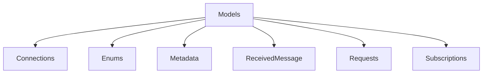

# Models

## Contents

- [Overview](#overview)
- [Files](#files)
- [Types and Members](#types-and-members)
- [Validation and Constraints](#validation-and-constraints)
- [Diagrams](#diagrams)
- [Examples](#examples)
- [See Also](#see-also)

## Overview

The **Models** area groups 1 documented type, including `CipheringMetadata`. It provides the contracts and implementation used by this part of ThunderPropagator.Clients.DotNet.

## Files

| File | Primary type(s)/symbol(s) | LOC (approx.) | Responsibility |
|---|---|---:|---|
| `CipheringMetadata.cs` | `CipheringMetadata` | 12 | Defines CipheringMetadata and its related behavior. |

### Direct child areas

- [Connections](./Connections/README.md) `Types:2` `Files:2`
- [Enums](./Enums/README.md) `Types:10` `Files:10`
- [Metadata](./Metadata/README.md) `Types:7` `Files:7`
- [ReceivedMessage](./ReceivedMessage/README.md) `Types:2` `Files:2`
- [Requests](./Requests/README.md) `Types:1` `Files:5`
- [Subscriptions](./Subscriptions/README.md) `Types:4` `Files:5`

## Types and Members

| Type | Kind | Summary | Inherits/Implements | Key Members |
|---|---|---|---|---|
| [`CipheringMetadata`](#cipheringmetadata) | class | Represents the CipheringMetadata class. | — | `KeySize`, `Key` |

### CipheringMetadata

- **Kind:** class
- **Namespace:** `ThunderPropagator.Clients.DotNet.Models`
- **Inherits/implements:** None declared
- **Attributes:** None detected
- **Key members:** `KeySize`, `Key`
- **Summary:** Represents the CipheringMetadata class.
- **Thread safety:** Follow the lifetime and concurrency guarantees of the owning component; no additional guarantee is inferred.

**Usage recipe**

```csharp
// Resolve CipheringMetadata from the configured service container or construct it with its declared dependencies.
```

[↑ Back to top](#contents)

## Validation and Constraints

Inputs are validated at component boundaries. Callers should provide non-null required values and handle domain or argument exceptions without retrying invalid requests unchanged.

## Diagrams

### Component overview



The diagram shows the direct components documented by the **Models** area.

## Examples

Start with `CipheringMetadata` as the primary entry point for this folder, then follow its linked contracts and collaborators.

## See Also

- [Documentation home](../README.md)
- [Channels](../Channels/README.md)
- [Clients](../Clients/README.md)
- [Connections](../Connections/README.md)
- [Infrastructure](../Infrastructure/README.md)
- [instructions](../instructions/README.md)

[↑ Back to top](#contents)
