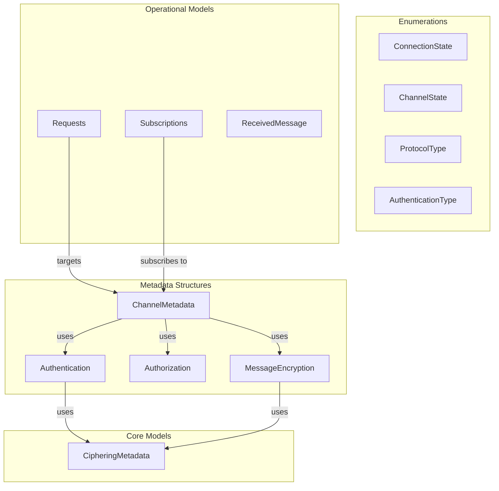

# Models

## Contents

- [Overview](#overview)
- [Root Files](#root-files)
- [Subfolders](#subfolders)
- [Diagrams](#diagrams)
- [See Also](#see-also)

## Overview

The Models folder contains all data models, enumerations, and structures used throughout the ThunderPropagator client library. This includes connection metadata, channel configurations, request/response models, subscription structures, and enumeration types defining states and behaviors.

All model classes use conditional sealing (`#if !DEBUG sealed #endif`) and follow immutable patterns where appropriate.

## Root Files

| File | Primary Type | LOC (approx) | Responsibility |
|------|-------------|--------------|----------------|
| CipheringMetadata.cs | CipheringMetadata | ~10 | Encryption key and size configuration |

### CipheringMetadata

Configuration for RSA encryption/decryption operations.

**Properties**:
- `KeySize: int` — RSA key size (default: 512 bits)
- `Key: string` — RSA key (required)

## Subfolders

### [Enums](./Enums/README.md)
Enumeration types defining connection states, channel states, protocol types, authentication types, and operational modes.

`Types:10` `Files:10` `Diagrams:✗`

### [Metadata](./Metadata/README.md)
Channel metadata structures describing authentication, authorization, encryption, programs, requests, and snapshots.

`Types:7` `Files:7` `Diagrams:✓`

### [Connections](./Connections/README.md)
Connection-related models including connection responses and push message configurations.

`Types:2` `Files:2` `Diagrams:✗`

### [ReceivedMessage](./ReceivedMessage/README.md)
Structures for messages received from channels including headers and data payloads.

`Types:2` `Files:2` `Diagrams:✗`

### [Requests](./Requests/README.md)
Concrete request implementations for metadata, subscriptions, pings, and unsubscribe operations.

`Types:5` `Files:5` `Diagrams:✗`

### [Subscriptions](./Subscriptions/README.md)
Subscription management models including subscription tables, items, updates, and operational interfaces.

`Types:5` `Files:5` `Diagrams:✓`

## Diagrams

### Models Overview

Shows relationships between core models, enumerations, metadata, and operational structures.

[↑ Back to top](#contents)

---

## See Also

- [Infrastructure](../Infrastructure/README.md) — Core abstractions using these models
- [Channels](../Channels/README.md) — Channels using metadata and requests
- [Connections](../Connections/README.md) — Connections using configurations

[↑ Back to top](#contents)
