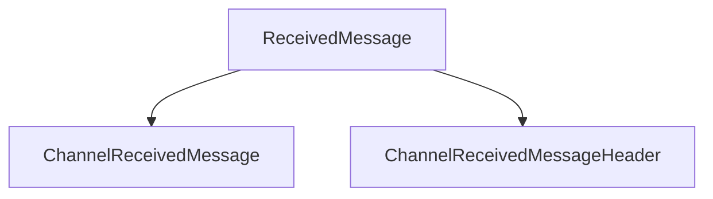

# ReceivedMessage

## Contents

- [Overview](#overview)
- [Files](#files)
- [Types and Members](#types-and-members)
- [Diagrams](#diagrams)
- [Examples](#examples)
- [See Also](#see-also)

## Overview

The **ReceivedMessage** area groups 2 documented types, including `ChannelReceivedMessage`, `ChannelReceivedMessageHeader`. It provides the contracts and implementation used by this part of ThunderPropagator.Clients.DotNet.

## Files

| File | Primary type(s)/symbol(s) | LOC (approx.) | Responsibility |
|---|---|---:|---|
| `ChannelReceivedMessage.cs` | `ChannelReceivedMessage` | 20 | Defines ChannelReceivedMessage and its related behavior. |
| `ChannelReceivedMessageHeader.cs` | `ChannelReceivedMessageHeader` | 28 | Defines ChannelReceivedMessageHeader and its related behavior. |

## Types and Members

| Type | Kind | Summary | Inherits/Implements | Key Members |
|---|---|---|---|---|
| [`ChannelReceivedMessage`](#channelreceivedmessage) | class | Represents the ChannelReceivedMessage class. | — | `Header`, `Keys`, `Values` |
| [`ChannelReceivedMessageHeader`](#channelreceivedmessageheader) | class | Represents the ChannelReceivedMessageHeader class. | — | `ChannelName`, `RequestId`, `FromSnapshot`, `RecordStatus`, `GetHashCode(…)` |

### ChannelReceivedMessage

- **Kind:** class
- **Namespace:** `ThunderPropagator.Clients.DotNet.Models.ReceivedMessage`
- **Inherits/implements:** None declared
- **Attributes:** None detected
- **Key members:** `Header`, `Keys`, `Values`
- **Summary:** Represents the ChannelReceivedMessage class.
- **Thread safety:** Follow the lifetime and concurrency guarantees of the owning component; no additional guarantee is inferred.

**Usage recipe**

```csharp
// Resolve ChannelReceivedMessage from the configured service container or construct it with its declared dependencies.
```

[↑ Back to top](#contents)

### ChannelReceivedMessageHeader

- **Kind:** class
- **Namespace:** `ThunderPropagator.Clients.DotNet.Models.ReceivedMessage`
- **Inherits/implements:** None declared
- **Attributes:** None detected
- **Key members:** `ChannelName`, `RequestId`, `FromSnapshot`, `RecordStatus`, `GetHashCode(…)`
- **Summary:** Represents the ChannelReceivedMessageHeader class.
- **Thread safety:** Follow the lifetime and concurrency guarantees of the owning component; no additional guarantee is inferred.

**Usage recipe**

```csharp
// Resolve ChannelReceivedMessageHeader from the configured service container or construct it with its declared dependencies.
```

[↑ Back to top](#contents)

## Diagrams

### Component overview



The diagram shows the direct components documented by the **ReceivedMessage** area.

## Examples

Start with `ChannelReceivedMessage` as the primary entry point for this folder, then follow its linked contracts and collaborators.

## See Also

- [Parent area](../README.md)
- [Connections](../Connections/README.md)
- [Enums](../Enums/README.md)
- [Metadata](../Metadata/README.md)
- [Requests](../Requests/README.md)
- [Subscriptions](../Subscriptions/README.md)

[↑ Back to top](#contents)
