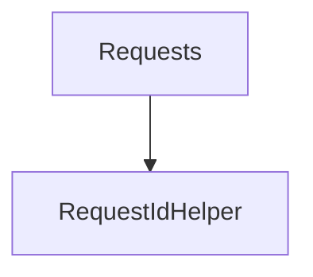

# Requests

## Contents

- [Overview](#overview)
- [Files](#files)
- [Types and Members](#types-and-members)
- [Diagrams](#diagrams)
- [Examples](#examples)
- [See Also](#see-also)

## Overview

The **Requests** area groups 1 documented type, including `RequestIdHelper`. It provides the contracts and implementation used by this part of ThunderPropagator.Clients.DotNet.

## Files

| File | Primary type(s)/symbol(s) | LOC (approx.) | Responsibility |
|---|---|---:|---|
| `RequestIdHelper.cs` | `RequestIdHelper` | 7 | Defines RequestIdHelper and its related behavior. |
| `ThunderPropagatorMetadataRequest.cs` | `ThunderPropagatorMetadataRequest` | 17 | Defines ThunderPropagatorMetadataRequest and its related behavior. |
| `ThunderPropagatorPingRequest.cs` | `ThunderPropagatorPingRequest` | 17 | Defines ThunderPropagatorPingRequest and its related behavior. |
| `ThunderPropagatorSubscriptionRequest.cs` | `ThunderPropagatorSubscriptionRequest` | 37 | Defines ThunderPropagatorSubscriptionRequest and its related behavior. |
| `ThunderPropagatorUnsubscribeRequest.cs` | `ThunderPropagatorUnsubscribeRequest` | 31 | Defines ThunderPropagatorUnsubscribeRequest and its related behavior. |

## Types and Members

| Type | Kind | Summary | Inherits/Implements | Key Members |
|---|---|---|---|---|
| [`RequestIdHelper`](#requestidhelper) | class | Represents the RequestIdHelper class. | — | `Generate(…)` |

### RequestIdHelper

- **Kind:** class
- **Namespace:** `ThunderPropagator.Clients.DotNet.Models.Requests`
- **Inherits/implements:** None declared
- **Attributes:** None detected
- **Key members:** `Generate(…)`
- **Summary:** Represents the RequestIdHelper class.
- **Thread safety:** Follow the lifetime and concurrency guarantees of the owning component; no additional guarantee is inferred.

**Usage recipe**

```csharp
// Resolve RequestIdHelper from the configured service container or construct it with its declared dependencies.
```

[↑ Back to top](#contents)

## Diagrams

### Component overview



The diagram shows the direct components documented by the **Requests** area.

## Examples

Start with `RequestIdHelper` as the primary entry point for this folder, then follow its linked contracts and collaborators.

## See Also

- [Parent area](../README.md)
- [Connections](../Connections/README.md)
- [Enums](../Enums/README.md)
- [Metadata](../Metadata/README.md)
- [ReceivedMessage](../ReceivedMessage/README.md)
- [Subscriptions](../Subscriptions/README.md)

[↑ Back to top](#contents)
