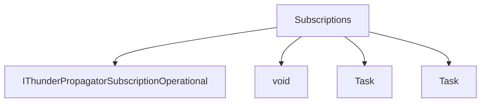

# Subscriptions

## Contents

- [Overview](#overview)
- [Files](#files)
- [Types and Members](#types-and-members)
- [Validation and Constraints](#validation-and-constraints)
- [Diagrams](#diagrams)
- [Examples](#examples)
- [See Also](#see-also)

## Overview

The **Subscriptions** area groups 4 documented types, including `IThunderPropagatorSubscriptionOperational`, `void`, `Task`, `Task`. It provides the contracts and implementation used by this part of ThunderPropagator.Clients.DotNet.

## Files

| File | Primary type(s)/symbol(s) | LOC (approx.) | Responsibility |
|---|---|---:|---|
| `ClientSubscriptionTable.cs` | `ClientSubscriptionTable` | 13 | Defines ClientSubscriptionTable and its related behavior. |
| `IThunderPropagatorSubscriptionOperational.cs` | `IThunderPropagatorSubscriptionOperational` | 17 | Defines IThunderPropagatorSubscriptionOperational and its related behavior. |
| `ThunderPropagatorSubscription.cs` | `void`, `Task`, `Task`, `ThunderPropagatorSubscription` | 243 | Defines void, Task, Task and its related behavior. |
| `ThunderPropagatorSubscriptionItemUpdate.cs` | `ThunderPropagatorSubscriptionItemUpdate` | 37 | Defines ThunderPropagatorSubscriptionItemUpdate and its related behavior. |
| `ThunderPropagatorSubscriptions.cs` | `ThunderPropagatorSubscriptions` | 120 | Defines ThunderPropagatorSubscriptions and its related behavior. |

## Types and Members

| Type | Kind | Summary | Inherits/Implements | Key Members |
|---|---|---|---|---|
| [`IThunderPropagatorSubscriptionOperational`](#ithunderpropagatorsubscriptionoperational) | interface | Represents the IThunderPropagatorSubscriptionOperational interface. | — | — |
| [`void`](#void) | delegate | Represents the void delegate. | — | `ThunderPropagatorFieldUpdatedEventHandler(…)`, `SubscribingKeys`, `SubscribingFields`, `SubscriptionMode`, `SubscribeAsync(…)` |
| [`Task`](#task) | delegate | Represents the Task delegate. | — | `SubscribingKeys`, `SubscribingFields`, `SubscriptionMode`, `SubscribeAsync(…)` |
| [`Task`](#task) | delegate | Represents the Task delegate. | — | `SubscribingKeys`, `SubscribingFields`, `SubscriptionMode`, `SubscribeAsync(…)` |

### IThunderPropagatorSubscriptionOperational

- **Kind:** interface
- **Namespace:** `ThunderPropagator.Clients.DotNet.Models.Subscriptions`
- **Inherits/implements:** None declared
- **Attributes:** None detected
- **Key members:** Refer to the API surface in the source package
- **Summary:** Represents the IThunderPropagatorSubscriptionOperational interface.
- **Thread safety:** Follow the lifetime and concurrency guarantees of the owning component; no additional guarantee is inferred.

**Usage recipe**

```csharp
// Resolve IThunderPropagatorSubscriptionOperational from the configured service container or construct it with its declared dependencies.
```

[↑ Back to top](#contents)

### void

- **Kind:** delegate
- **Namespace:** `ThunderPropagator.Clients.DotNet.Models.Subscriptions`
- **Inherits/implements:** None declared
- **Attributes:** None detected
- **Key members:** `ThunderPropagatorFieldUpdatedEventHandler(…)`, `SubscribingKeys`, `SubscribingFields`, `SubscriptionMode`, `SubscribeAsync(…)`
- **Summary:** Represents the void delegate.
- **Thread safety:** Follow the lifetime and concurrency guarantees of the owning component; no additional guarantee is inferred.

**Usage recipe**

```csharp
// Resolve void from the configured service container or construct it with its declared dependencies.
```

[↑ Back to top](#contents)

### Task

- **Kind:** delegate
- **Namespace:** `ThunderPropagator.Clients.DotNet.Models.Subscriptions`
- **Inherits/implements:** None declared
- **Attributes:** None detected
- **Key members:** `SubscribingKeys`, `SubscribingFields`, `SubscriptionMode`, `SubscribeAsync(…)`
- **Summary:** Represents the Task delegate.
- **Thread safety:** Follow the lifetime and concurrency guarantees of the owning component; no additional guarantee is inferred.

**Usage recipe**

```csharp
// Resolve Task from the configured service container or construct it with its declared dependencies.
```

[↑ Back to top](#contents)

### Task

- **Kind:** delegate
- **Namespace:** `ThunderPropagator.Clients.DotNet.Models.Subscriptions`
- **Inherits/implements:** None declared
- **Attributes:** None detected
- **Key members:** `SubscribingKeys`, `SubscribingFields`, `SubscriptionMode`, `SubscribeAsync(…)`
- **Summary:** Represents the Task delegate.
- **Thread safety:** Follow the lifetime and concurrency guarantees of the owning component; no additional guarantee is inferred.

**Usage recipe**

```csharp
// Resolve Task from the configured service container or construct it with its declared dependencies.
```

[↑ Back to top](#contents)

## Validation and Constraints

Inputs are validated at component boundaries. Callers should provide non-null required values and handle domain or argument exceptions without retrying invalid requests unchanged.

## Diagrams

### Component overview



The diagram shows the direct components documented by the **Subscriptions** area.

## Examples

Start with `IThunderPropagatorSubscriptionOperational` as the primary entry point for this folder, then follow its linked contracts and collaborators.

## See Also

- [Parent area](../README.md)
- [Connections](../Connections/README.md)
- [Enums](../Enums/README.md)
- [Metadata](../Metadata/README.md)
- [ReceivedMessage](../ReceivedMessage/README.md)
- [Requests](../Requests/README.md)

[↑ Back to top](#contents)
