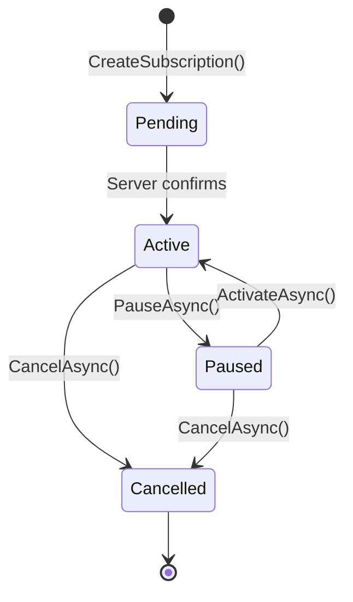
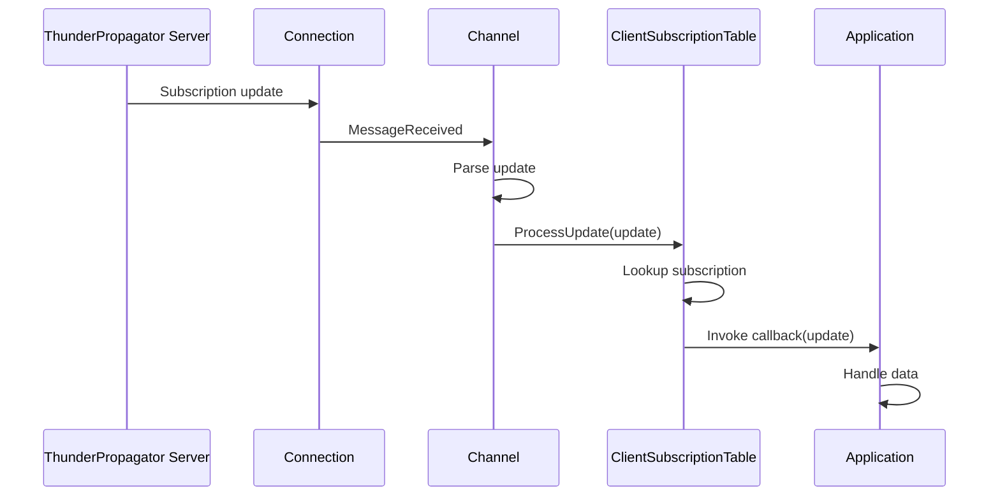

# Models / Subscriptions

## Contents

- [Overview](#overview)
- [Files](#files)
- [Key Types](#key-types)
- [Diagrams](#diagrams)
- [See Also](#see-also)

## Overview

Subscription management models including subscription tables, individual subscription items, update notifications, operational interfaces, and subscription collections.

## Files

| File | Primary Type | LOC (approx) | Responsibility |
|------|-------------|--------------|----------------|
| ThunderPropagatorSubscriptions.cs | ThunderPropagatorSubscriptions | ~30 | Collection of subscriptions |
| ThunderPropagatorSubscription.cs | ThunderPropagatorSubscription | ~40 | Individual subscription |
| ThunderPropagatorSubscriptionItemUpdate.cs | ThunderPropagatorSubscriptionItemUpdate | ~20 | Subscription data update |
| IThunderPropagatorSubscriptionOperational.cs | IThunderPropagatorSubscriptionOperational | ~15 | Operational interface |
| ClientSubscriptionTable.cs | ClientSubscriptionTable | ~60 | Client-side subscription tracking |

## Key Types

### ThunderPropagatorSubscription

**Namespace**: `ThunderPropagator.Clients.DotNet.Models.Subscriptions`  
**Implements**: `IThunderPropagatorSubscriptionOperational`

Represents an individual subscription to a data stream.

**Key Properties**:

- `SubscriptionId: string` — Unique subscription identifier
- `Channel: string` — Target channel name
- `SubscribingKeys: IReadOnlyDictionary<string, string>` — Subscription key filters
- `SubscribingFields: IReadOnlyCollection<string>` — Fields being received
- `SubscriptionMode: ThunderPropagatorSubscriptionMode` — Delivery mode
- `Status: ThunderPropagatorSubscriptionStatus` — Current state
- `CreatedAt: DateTime` — Creation timestamp

**Key Methods**:

- `ActivateAsync()` — Activate subscription
- `PauseAsync()` — Pause subscription
- `CancelAsync()` — Cancel subscription

### ThunderPropagatorSubscriptions

**Namespace**: `ThunderPropagator.Clients.DotNet.Models.Subscriptions`

Collection of subscriptions for a channel.

**Key Properties**:

- `Items: Dictionary<string, ThunderPropagatorSubscription>` — Active subscriptions
- `Count: int` — Number of subscriptions

**Key Methods**:

- `Add(subscription)` — Add subscription
- `Remove(subscriptionId)` — Remove subscription
- `GetSubscription(subscriptionId)` — Retrieve by ID

### ThunderPropagatorSubscriptionItemUpdate

**Namespace**: `ThunderPropagator.Clients.DotNet.Models.Subscriptions`

Represents an update to subscription data.

**Key Properties**:

- `SubscriptionId: string` — Target subscription
- `RecordStatus: ThunderPropagatorRecordStatus` — Update type (Insert/Update/Delete)
- `Keys: Dictionary<string, string>` — Record keys
- `Fields: Dictionary<string, object?>` — Updated field values
- `Timestamp: DateTime` — Update timestamp

### IThunderPropagatorSubscriptionOperational

**Namespace**: `ThunderPropagator.Clients.DotNet.Models.Subscriptions`

Interface for subscription operations.

**Key Methods**:

- `Task ActivateAsync(CancellationToken)` — Activate subscription
- `Task PauseAsync(CancellationToken)` — Pause updates
- `Task CancelAsync(CancellationToken)` — Cancel and remove

### ClientSubscriptionTable

**Namespace**: `ThunderPropagator.Clients.DotNet.Models.Subscriptions`

Client-side tracking table for subscription state management.

**Key Properties**:

- `Subscriptions: BindingDictionary<string, ThunderPropagatorSubscription>` — Subscription registry
- `UpdateCallbacks: Dictionary<string, Action<ThunderPropagatorSubscriptionItemUpdate>>` — Update handlers

**Key Methods**:

- `RegisterSubscription(subscription, callback)` — Register new subscription
- `UnregisterSubscription(subscriptionId)` — Remove subscription
- `ProcessUpdate(update)` — Handle incoming update

[↑ Back to top](#contents)

---

## Diagrams

### Subscription Lifecycle

### Subscription Update Flow

Shows the flow of subscription updates from server to application callback.

[↑ Back to top](#contents)

---

## See Also

- [Models](../README.md) — Parent models overview
- [Infrastructure/Channels](../../Infrastructure/Channels/README.md) — Channels managing subscriptions

[↑ Back to top](#contents)
