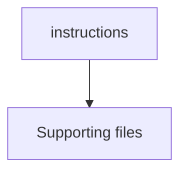

# instructions

## Contents

- [Overview](#overview)
- [Files](#files)
- [Diagrams](#diagrams)
- [Examples](#examples)
- [See Also](#see-also)

## Overview

The **instructions** area contains configuration, scripts, or supporting files used by ThunderPropagator.Clients.DotNet. The tables below describe the role of each file and how it participates in the repository workflow.

## Files

| File | Primary type(s)/symbol(s) | LOC (approx.) | Responsibility |
|---|---|---:|---|
| `README.md` | — | 80 | Contains the readme implementation or configuration. |

## Diagrams

### Component overview

The diagram shows the direct components documented by the **instructions** area.

## Examples

*Not applicable until implementation files are added.*

## See Also

- [Documentation home](../README.md)
- [Channels](../Channels/README.md)
- [Clients](../Clients/README.md)
- [Connections](../Connections/README.md)
- [Infrastructure](../Infrastructure/README.md)
- [Models](../Models/README.md)

[↑ Back to top](#contents)
